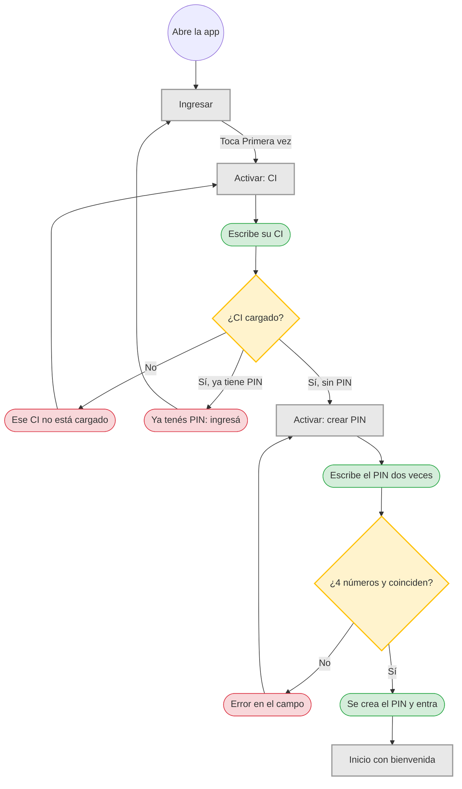

# UC-01 · Activar la cuenta — flujo

Primer ingreso: solo con el CI se crea un PIN de 4 dígitos (se escribe dos veces).

```mermaid
graph TD
    Inicio((Abre la app)) --> Ingresar["Ingresar"]
    Ingresar -->|"Toca Primera vez"| Activar["Activar: CI"]
    Activar --> EscribeCI(["Escribe su CI"])
    EscribeCI --> CiOk{"¿CI cargado?"}
    CiOk -->|"No"| ErrCi(["Ese CI no está cargado"])
    ErrCi --> Activar
    CiOk -->|"Sí, ya tiene PIN"| YaTiene(["Ya tenés PIN: ingresá"])
    YaTiene --> Ingresar
    CiOk -->|"Sí, sin PIN"| CrearPin["Activar: crear PIN"]
    CrearPin --> EscribePin(["Escribe el PIN dos veces"])
    EscribePin --> PinOk{"¿4 números y coinciden?"}
    PinOk -->|"No"| ErrPin(["Error en el campo"])
    ErrPin --> CrearPin
    PinOk -->|"Sí"| Guarda(["Se crea el PIN y entra"])
    Guarda --> Bienvenida["Inicio con bienvenida"]

    class Ingresar,Activar,CrearPin,Bienvenida screen
    class CiOk,PinOk decision
    class EscribeCI,EscribePin,Guarda action
    class ErrCi,YaTiene,ErrPin error

    classDef screen fill:#e8e8e8,stroke:#999,stroke-width:2px
    classDef decision fill:#fff3cd,stroke:#ffc107,stroke-width:2px
    classDef action fill:#d4edda,stroke:#28a745,stroke-width:1px
    classDef error fill:#f8d7da,stroke:#dc3545,stroke-width:1px
```
