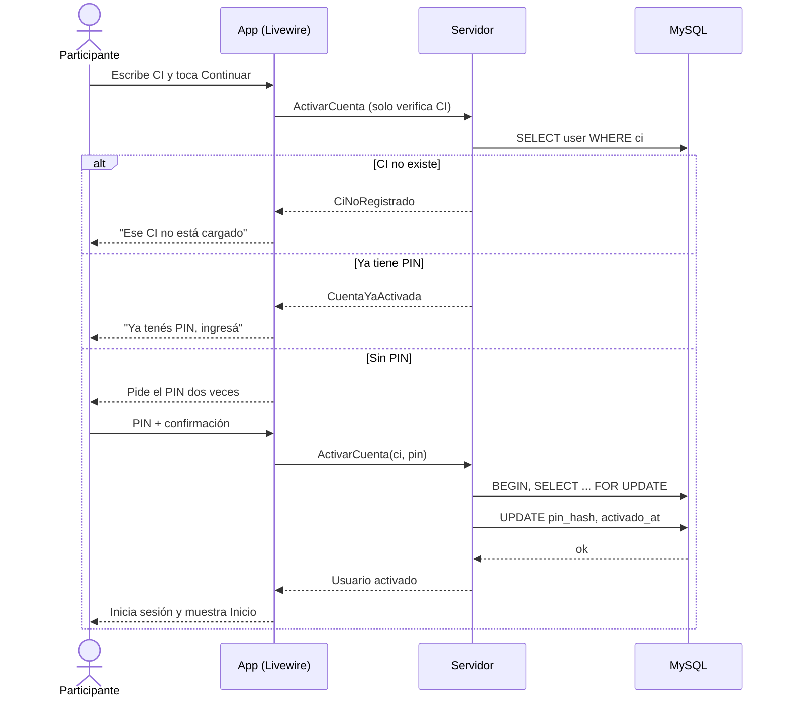

# UC-01 · Activar la cuenta — secuencia

```mermaid
sequenceDiagram
    actor U as Participante
    participant App as App (Livewire)
    participant API as Servidor
    participant DB as MySQL

    U->>App: Escribe CI y toca Continuar
    App->>API: ActivarCuenta (solo verifica CI)
    API->>DB: SELECT user WHERE ci
    alt CI no existe
        API-->>App: CiNoRegistrado
        App-->>U: "Ese CI no está cargado"
    else Ya tiene PIN
        API-->>App: CuentaYaActivada
        App-->>U: "Ya tenés PIN, ingresá"
    else Sin PIN
        App-->>U: Pide el PIN dos veces
        U->>App: PIN + confirmación
        App->>API: ActivarCuenta(ci, pin)
        API->>DB: BEGIN, SELECT ... FOR UPDATE
        API->>DB: UPDATE pin_hash, activado_at
        DB-->>API: ok
        API-->>App: Usuario activado
        App-->>U: Inicia sesión y muestra Inicio
    end
```
