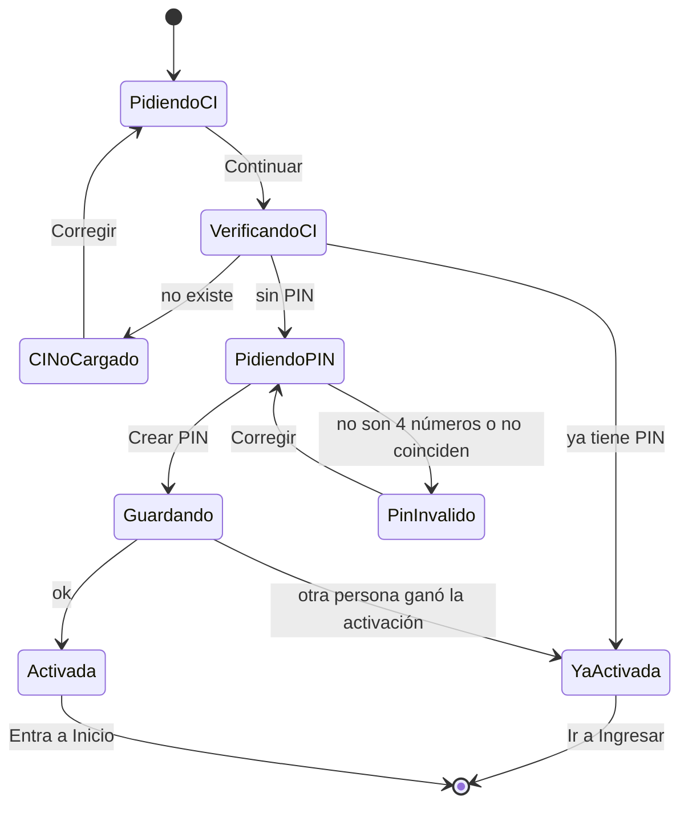

# UC-01 · Activar la cuenta — estados

```mermaid
stateDiagram-v2
    [*] --> PidiendoCI
    PidiendoCI --> VerificandoCI: Continuar
    VerificandoCI --> CINoCargado: no existe
    VerificandoCI --> YaActivada: ya tiene PIN
    VerificandoCI --> PidiendoPIN: sin PIN
    CINoCargado --> PidiendoCI: Corregir
    YaActivada --> [*]: Ir a Ingresar
    PidiendoPIN --> Guardando: Crear PIN
    PidiendoPIN --> PinInvalido: no son 4 números o no coinciden
    PinInvalido --> PidiendoPIN: Corregir
    Guardando --> Activada: ok
    Guardando --> YaActivada: otra persona ganó la activación
    Activada --> [*]: Entra a Inicio
```
