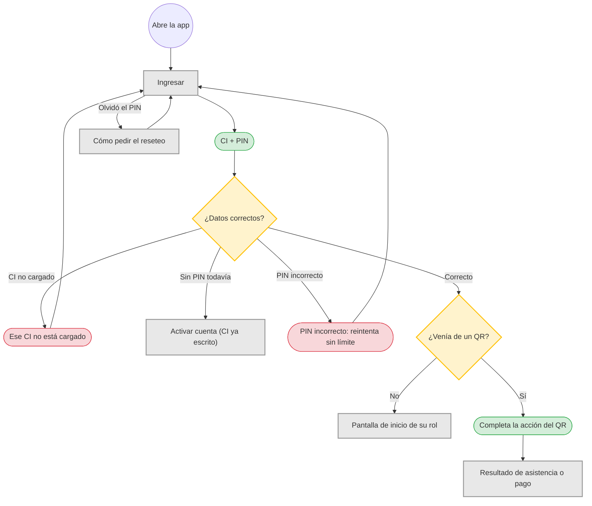

# UC-02 · Ingresar — flujo

Login con CI + PIN. No hay bloqueo ni límite de intentos.

```mermaid
graph TD
    Inicio((Abre la app)) --> Ingresar["Ingresar"]
    Ingresar --> Escribe(["CI + PIN"])
    Escribe --> Valida{"¿Datos correctos?"}
    Valida -->|"CI no cargado"| ErrCi(["Ese CI no está cargado"])
    Valida -->|"Sin PIN todavía"| Activar["Activar cuenta (CI ya escrito)"]
    Valida -->|"PIN incorrecto"| ErrPin(["PIN incorrecto: reintenta sin límite"])
    ErrCi --> Ingresar
    ErrPin --> Ingresar
    Valida -->|"Correcto"| Destino{"¿Venía de un QR?"}
    Destino -->|"No"| Home["Pantalla de inicio de su rol"]
    Destino -->|"Sí"| Completa(["Completa la acción del QR"])
    Completa --> Resultado["Resultado de asistencia o pago"]
    Ingresar -->|"Olvidó el PIN"| Ayuda["Cómo pedir el reseteo"]
    Ayuda --> Ingresar

    class Ingresar,Activar,Home,Resultado,Ayuda screen
    class Valida,Destino decision
    class Escribe,Completa action
    class ErrCi,ErrPin error

    classDef screen fill:#e8e8e8,stroke:#999,stroke-width:2px
    classDef decision fill:#fff3cd,stroke:#ffc107,stroke-width:2px
    classDef action fill:#d4edda,stroke:#28a745,stroke-width:1px
    classDef error fill:#f8d7da,stroke:#dc3545,stroke-width:1px
```
