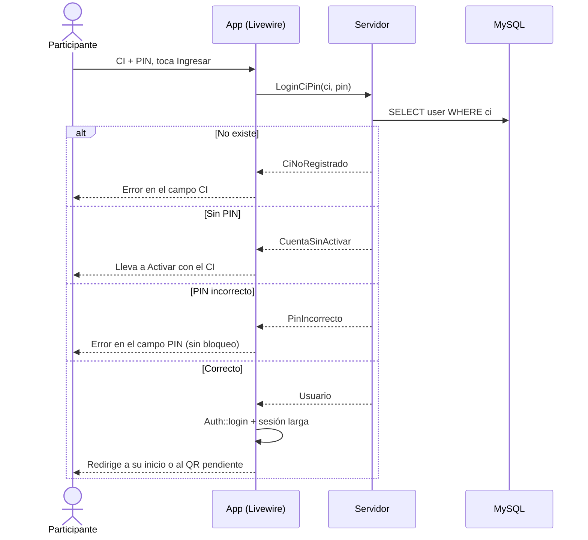

# UC-02 · Ingresar — secuencia

```mermaid
sequenceDiagram
    actor U as Participante
    participant App as App (Livewire)
    participant API as Servidor
    participant DB as MySQL

    U->>App: CI + PIN, toca Ingresar
    App->>API: LoginCiPin(ci, pin)
    API->>DB: SELECT user WHERE ci
    alt No existe
        API-->>App: CiNoRegistrado
        App-->>U: Error en el campo CI
    else Sin PIN
        API-->>App: CuentaSinActivar
        App-->>U: Lleva a Activar con el CI
    else PIN incorrecto
        API-->>App: PinIncorrecto
        App-->>U: Error en el campo PIN (sin bloqueo)
    else Correcto
        API-->>App: Usuario
        App->>App: Auth::login + sesión larga
        App-->>U: Redirige a su inicio o al QR pendiente
    end
```
