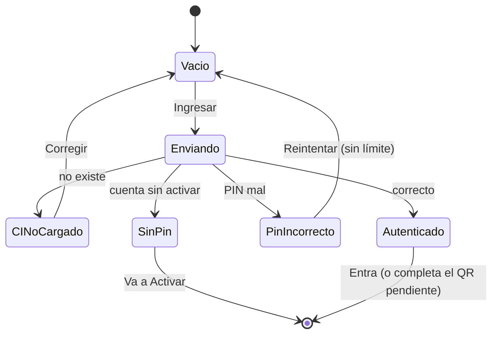

# UC-02 · Ingresar — estados

```mermaid
stateDiagram-v2
    [*] --> Vacio
    Vacio --> Enviando: Ingresar
    Enviando --> CINoCargado: no existe
    Enviando --> SinPin: cuenta sin activar
    Enviando --> PinIncorrecto: PIN mal
    Enviando --> Autenticado: correcto
    CINoCargado --> Vacio: Corregir
    PinIncorrecto --> Vacio: Reintentar (sin límite)
    SinPin --> [*]: Va a Activar
    Autenticado --> [*]: Entra (o completa el QR pendiente)
```
