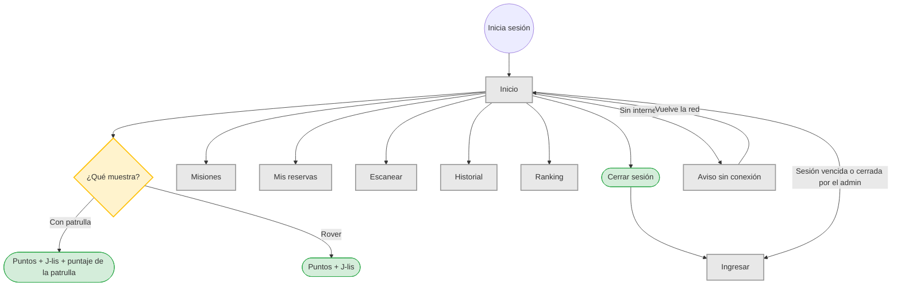

# UC-03 · Inicio — flujo

Resumen de saldos y atajos.

```mermaid
graph TD
    Entra((Inicia sesión)) --> Inicio["Inicio"]
    Inicio --> Datos{"¿Qué muestra?"}
    Datos -->|"Con patrulla"| ConPat(["Puntos + J-lis + puntaje de la patrulla"])
    Datos -->|"Rover"| SinPat(["Puntos + J-lis"])
    Inicio --> Misiones["Misiones"]
    Inicio --> Reservas["Mis reservas"]
    Inicio --> Escanear["Escanear"]
    Inicio --> Historial["Historial"]
    Inicio --> Ranking["Ranking"]
    Inicio --> Salir(["Cerrar sesión"])
    Salir --> Ingresar["Ingresar"]
    Inicio -->|"Sesión vencida o cerrada por el admin"| Ingresar
    Inicio -->|"Sin internet"| SinRed["Aviso sin conexión"]
    SinRed -->|"Vuelve la red"| Inicio

    class Inicio,Misiones,Reservas,Escanear,Historial,Ranking,Ingresar,SinRed screen
    class Datos decision
    class ConPat,SinPat,Salir action

    classDef screen fill:#e8e8e8,stroke:#999,stroke-width:2px
    classDef decision fill:#fff3cd,stroke:#ffc107,stroke-width:2px
    classDef action fill:#d4edda,stroke:#28a745,stroke-width:1px
    classDef error fill:#f8d7da,stroke:#dc3545,stroke-width:1px
```
