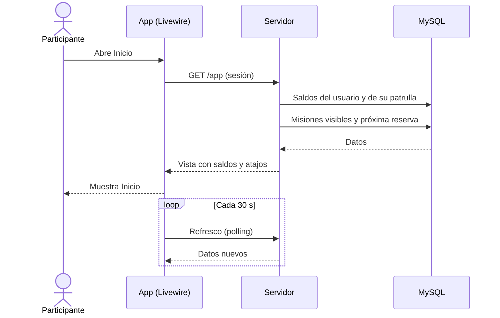

# UC-03 · Inicio — secuencia

```mermaid
sequenceDiagram
    actor U as Participante
    participant App as App (Livewire)
    participant API as Servidor
    participant DB as MySQL

    U->>App: Abre Inicio
    App->>API: GET /app (sesión)
    API->>DB: Saldos del usuario y de su patrulla
    API->>DB: Misiones visibles y próxima reserva
    DB-->>API: Datos
    API-->>App: Vista con saldos y atajos
    App-->>U: Muestra Inicio
    loop Cada 30 s
        App->>API: Refresco (polling)
        API-->>App: Datos nuevos
    end
```
