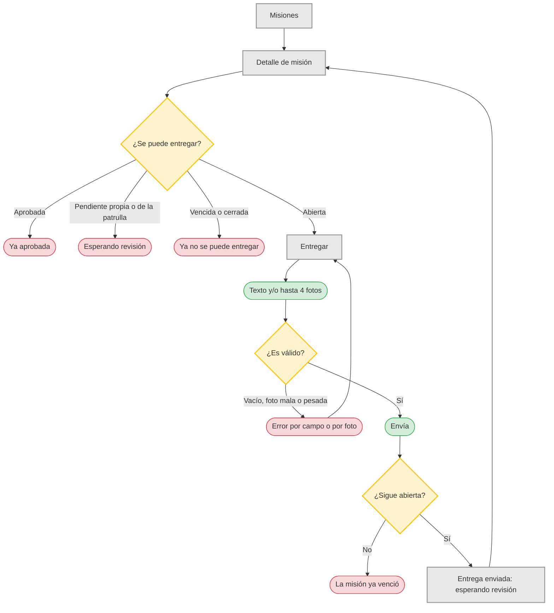

# UC-04 · Ver misiones y entregar — flujo

Cubre misión individual y por patrulla.

```mermaid
graph TD
    Lista["Misiones"] --> Detalle["Detalle de misión"]
    Detalle --> Estado{"¿Se puede entregar?"}
    Estado -->|"Aprobada"| Aprobada(["Ya aprobada"])
    Estado -->|"Pendiente propia o de la patrulla"| Pend(["Esperando revisión"])
    Estado -->|"Vencida o cerrada"| Cerrada(["Ya no se puede entregar"])
    Estado -->|"Abierta"| Entregar["Entregar"]
    Entregar --> Completa(["Texto y/o hasta 4 fotos"])
    Completa --> Valida{"¿Es válido?"}
    Valida -->|"Vacío, foto mala o pesada"| ErrCampo(["Error por campo o por foto"])
    ErrCampo --> Entregar
    Valida -->|"Sí"| Envia(["Envía"])
    Envia --> Servidor{"¿Sigue abierta?"}
    Servidor -->|"No"| Vencio(["La misión ya venció"])
    Servidor -->|"Sí"| Ok["Entrega enviada: esperando revisión"]
    Ok --> Detalle

    class Lista,Detalle,Entregar,Ok screen
    class Estado,Valida,Servidor decision
    class Completa,Envia action
    class ErrCampo,Vencio,Cerrada,Aprobada,Pend error

    classDef screen fill:#e8e8e8,stroke:#999,stroke-width:2px
    classDef decision fill:#fff3cd,stroke:#ffc107,stroke-width:2px
    classDef action fill:#d4edda,stroke:#28a745,stroke-width:1px
    classDef error fill:#f8d7da,stroke:#dc3545,stroke-width:1px
```
