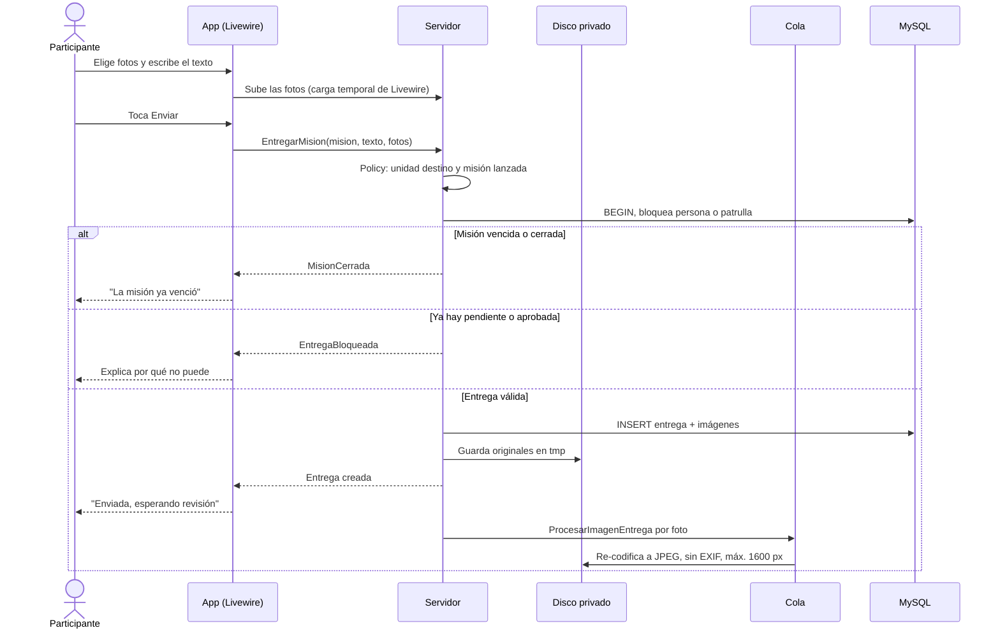

# UC-04 · Ver misiones y entregar — secuencia

```mermaid
sequenceDiagram
    actor U as Participante
    participant App as App (Livewire)
    participant API as Servidor
    participant Disco as Disco privado
    participant Cola as Cola
    participant DB as MySQL

    U->>App: Elige fotos y escribe el texto
    App->>API: Sube las fotos (carga temporal de Livewire)
    U->>App: Toca Enviar
    App->>API: EntregarMision(mision, texto, fotos)
    API->>API: Policy: unidad destino y misión lanzada
    API->>DB: BEGIN, bloquea persona o patrulla
    alt Misión vencida o cerrada
        API-->>App: MisionCerrada
        App-->>U: "La misión ya venció"
    else Ya hay pendiente o aprobada
        API-->>App: EntregaBloqueada
        App-->>U: Explica por qué no puede
    else Entrega válida
        API->>DB: INSERT entrega + imágenes
        API->>Disco: Guarda originales en tmp
        API-->>App: Entrega creada
        App-->>U: "Enviada, esperando revisión"
        API->>Cola: ProcesarImagenEntrega por foto
        Cola->>Disco: Re-codifica a JPEG, sin EXIF, máx. 1600 px
    end
```
