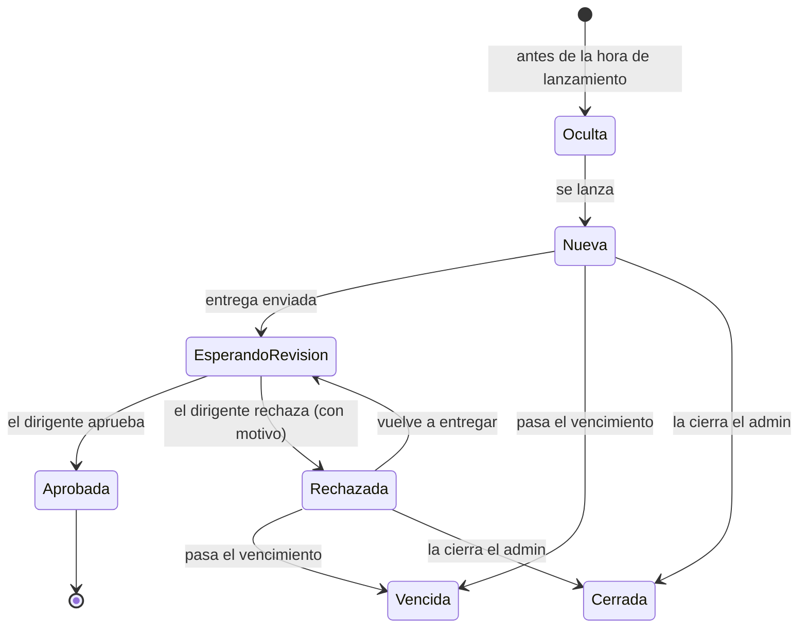

# UC-04 · Ver misiones y entregar — estados

Estado de una misión para quien la mira.

```mermaid
stateDiagram-v2
    [*] --> Oculta: antes de la hora de lanzamiento
    Oculta --> Nueva: se lanza
    Nueva --> EsperandoRevision: entrega enviada
    EsperandoRevision --> Aprobada: el dirigente aprueba
    EsperandoRevision --> Rechazada: el dirigente rechaza (con motivo)
    Rechazada --> EsperandoRevision: vuelve a entregar
    Nueva --> Vencida: pasa el vencimiento
    Rechazada --> Vencida: pasa el vencimiento
    Nueva --> Cerrada: la cierra el admin
    Rechazada --> Cerrada: la cierra el admin
    Aprobada --> [*]
```
