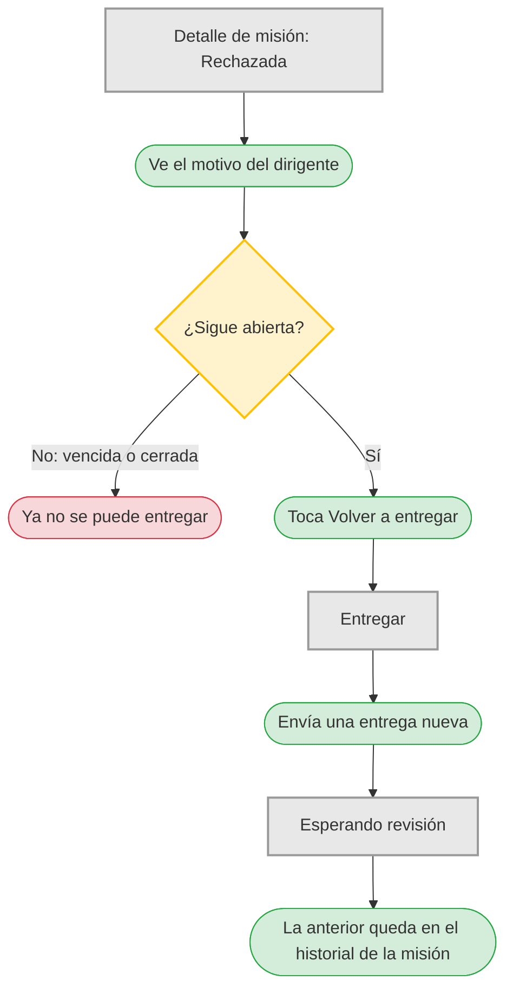

# UC-05 · Entrega rechazada → volver a entregar — flujo

```mermaid
graph TD
    Detalle["Detalle de misión: Rechazada"] --> Motivo(["Ve el motivo del dirigente"])
    Motivo --> Abierta{"¿Sigue abierta?"}
    Abierta -->|"No: vencida o cerrada"| NoMas(["Ya no se puede entregar"])
    Abierta -->|"Sí"| Reintenta(["Toca Volver a entregar"])
    Reintenta --> Entregar["Entregar"]
    Entregar --> Envia(["Envía una entrega nueva"])
    Envia --> Pendiente["Esperando revisión"]
    Pendiente --> Hist(["La anterior queda en el historial de la misión"])

    class Detalle,Entregar,Pendiente screen
    class Abierta decision
    class Motivo,Reintenta,Envia,Hist action
    class NoMas error

    classDef screen fill:#e8e8e8,stroke:#999,stroke-width:2px
    classDef decision fill:#fff3cd,stroke:#ffc107,stroke-width:2px
    classDef action fill:#d4edda,stroke:#28a745,stroke-width:1px
    classDef error fill:#f8d7da,stroke:#dc3545,stroke-width:1px
```
