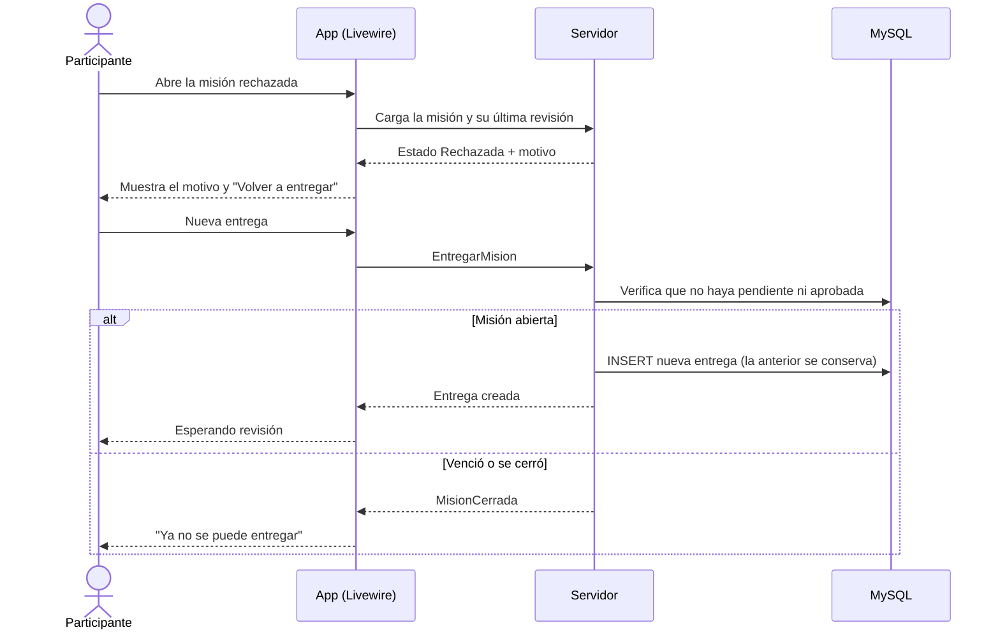

# UC-05 · Volver a entregar — secuencia

```mermaid
sequenceDiagram
    actor U as Participante
    participant App as App (Livewire)
    participant API as Servidor
    participant DB as MySQL

    U->>App: Abre la misión rechazada
    App->>API: Carga la misión y su última revisión
    API-->>App: Estado Rechazada + motivo
    App-->>U: Muestra el motivo y "Volver a entregar"
    U->>App: Nueva entrega
    App->>API: EntregarMision
    API->>DB: Verifica que no haya pendiente ni aprobada
    alt Misión abierta
        API->>DB: INSERT nueva entrega (la anterior se conserva)
        API-->>App: Entrega creada
        App-->>U: Esperando revisión
    else Venció o se cerró
        API-->>App: MisionCerrada
        App-->>U: "Ya no se puede entregar"
    end
```
