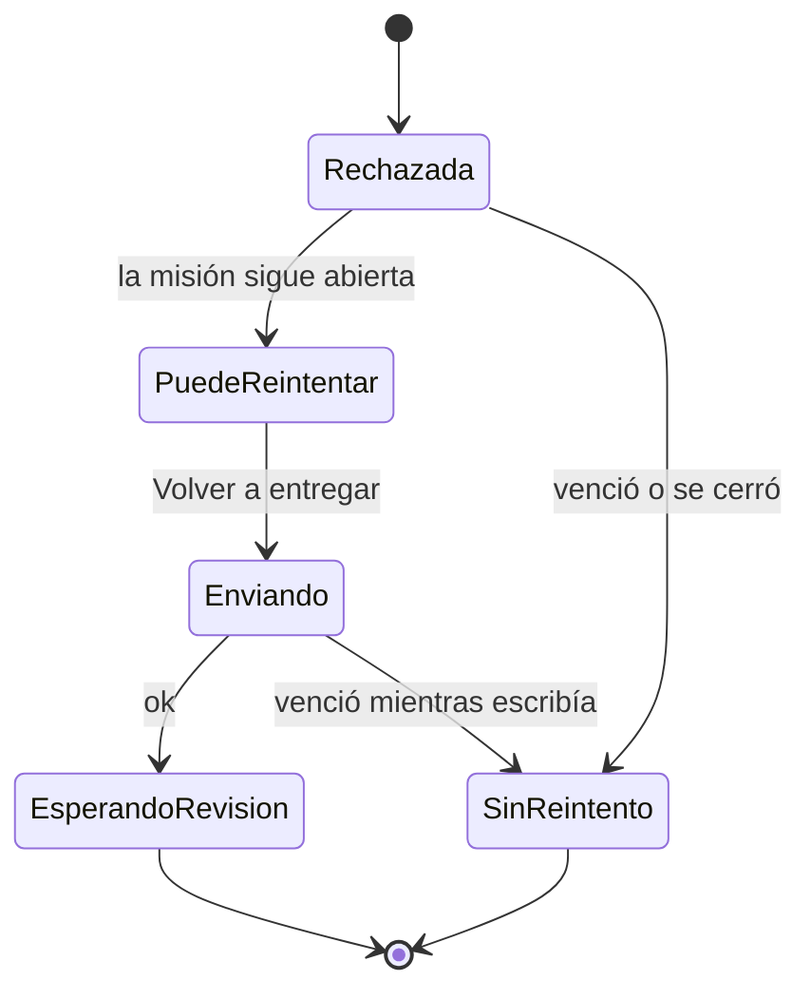

# UC-05 · Volver a entregar — estados

```mermaid
stateDiagram-v2
    [*] --> Rechazada
    Rechazada --> PuedeReintentar: la misión sigue abierta
    Rechazada --> SinReintento: venció o se cerró
    PuedeReintentar --> Enviando: Volver a entregar
    Enviando --> EsperandoRevision: ok
    Enviando --> SinReintento: venció mientras escribía
    EsperandoRevision --> [*]
    SinReintento --> [*]
```
