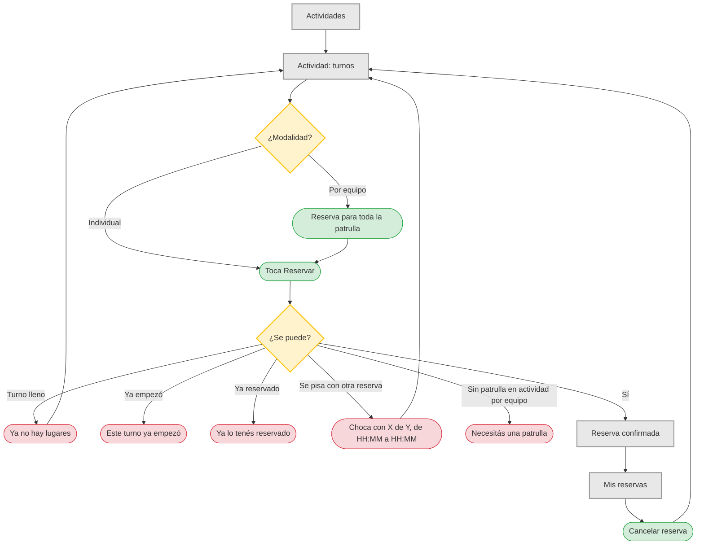

# UC-06 · Reservar un turno — flujo

Incluye el choque de horario y las actividades por equipo.

```mermaid
graph TD
    Lista["Actividades"] --> Detalle["Actividad: turnos"]
    Detalle --> Modal{"¿Modalidad?"}
    Modal -->|"Individual"| Reserva(["Toca Reservar"])
    Modal -->|"Por equipo"| Equipo(["Reserva para toda la patrulla"])
    Equipo --> Reserva
    Reserva --> Chequeo{"¿Se puede?"}
    Chequeo -->|"Turno lleno"| Lleno(["Ya no hay lugares"])
    Chequeo -->|"Ya empezó"| Empezo(["Este turno ya empezó"])
    Chequeo -->|"Ya reservado"| Dup(["Ya lo tenés reservado"])
    Chequeo -->|"Se pisa con otra reserva"| Choque(["Choca con X de Y, de HH:MM a HH:MM"])
    Chequeo -->|"Sin patrulla en actividad por equipo"| SinPat(["Necesitás una patrulla"])
    Chequeo -->|"Sí"| Ok["Reserva confirmada"]
    Ok --> Mis["Mis reservas"]
    Mis --> Cancelar(["Cancelar reserva"])
    Cancelar --> Detalle
    Lleno --> Detalle
    Choque --> Detalle

    class Lista,Detalle,Ok,Mis screen
    class Modal,Chequeo decision
    class Reserva,Equipo,Cancelar action
    class Lleno,Empezo,Dup,Choque,SinPat error

    classDef screen fill:#e8e8e8,stroke:#999,stroke-width:2px
    classDef decision fill:#fff3cd,stroke:#ffc107,stroke-width:2px
    classDef action fill:#d4edda,stroke:#28a745,stroke-width:1px
    classDef error fill:#f8d7da,stroke:#dc3545,stroke-width:1px
```
