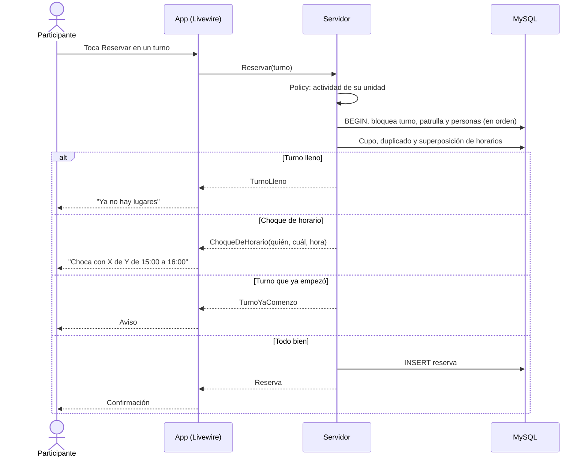

# UC-06 · Reservar un turno — secuencia

```mermaid
sequenceDiagram
    actor U as Participante
    participant App as App (Livewire)
    participant API as Servidor
    participant DB as MySQL

    U->>App: Toca Reservar en un turno
    App->>API: Reservar(turno)
    API->>API: Policy: actividad de su unidad
    API->>DB: BEGIN, bloquea turno, patrulla y personas (en orden)
    API->>DB: Cupo, duplicado y superposición de horarios
    alt Turno lleno
        API-->>App: TurnoLleno
        App-->>U: "Ya no hay lugares"
    else Choque de horario
        API-->>App: ChoqueDeHorario(quién, cuál, hora)
        App-->>U: "Choca con X de Y de 15:00 a 16:00"
    else Turno que ya empezó
        API-->>App: TurnoYaComenzo
        App-->>U: Aviso
    else Todo bien
        API->>DB: INSERT reserva
        API-->>App: Reserva
        App-->>U: Confirmación
    end
```
