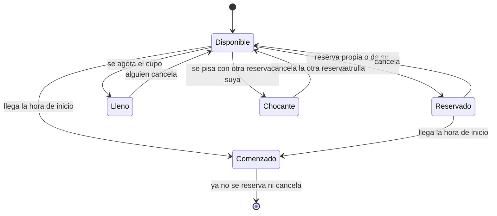

# UC-06 · Reservar un turno — estados de un turno

```mermaid
stateDiagram-v2
    [*] --> Disponible
    Disponible --> Reservado: reserva propia o de su patrulla
    Disponible --> Lleno: se agota el cupo
    Disponible --> Chocante: se pisa con otra reserva suya
    Reservado --> Disponible: cancela
    Lleno --> Disponible: alguien cancela
    Chocante --> Disponible: cancela la otra reserva
    Disponible --> Comenzado: llega la hora de inicio
    Reservado --> Comenzado: llega la hora de inicio
    Comenzado --> [*]: ya no se reserva ni cancela
```
