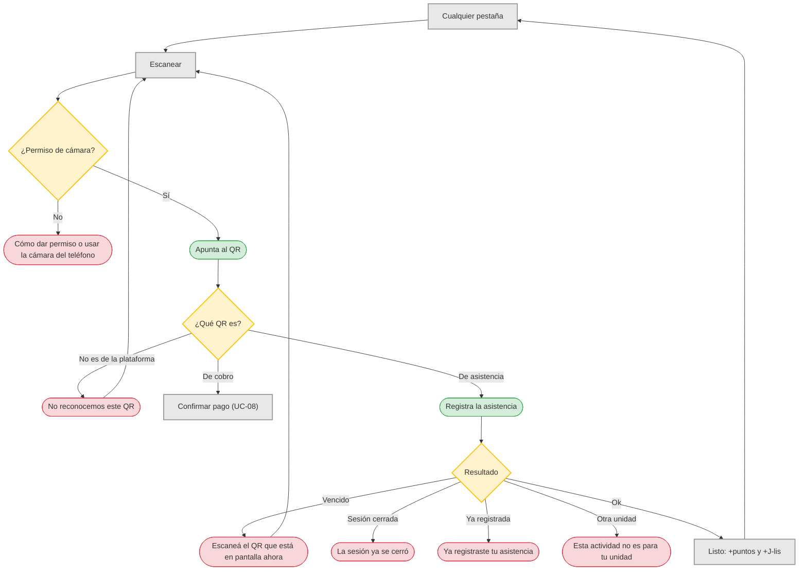

# UC-07 · Escanear asistencia — flujo

El botón Escanear es el mismo que para pagar; reconoce el tipo de QR.

```mermaid
graph TD
    Inicio["Cualquier pestaña"] --> Escanear["Escanear"]
    Escanear --> Permiso{"¿Permiso de cámara?"}
    Permiso -->|"No"| SinCam(["Cómo dar permiso o usar la cámara del teléfono"])
    Permiso -->|"Sí"| Apunta(["Apunta al QR"])
    Apunta --> Tipo{"¿Qué QR es?"}
    Tipo -->|"No es de la plataforma"| NoRec(["No reconocemos este QR"])
    NoRec --> Escanear
    Tipo -->|"De cobro"| Pago["Confirmar pago (UC-08)"]
    Tipo -->|"De asistencia"| Registra(["Registra la asistencia"])
    Registra --> Res{"Resultado"}
    Res -->|"Vencido"| Venc(["Escaneá el QR que está en pantalla ahora"])
    Res -->|"Sesión cerrada"| Cerr(["La sesión ya se cerró"])
    Res -->|"Ya registrada"| Ya(["Ya registraste tu asistencia"])
    Res -->|"Otra unidad"| Otra(["Esta actividad no es para tu unidad"])
    Res -->|"Ok"| Ok["Listo: +puntos y +J-lis"]
    Venc --> Escanear
    Ok --> Inicio

    class Inicio,Escanear,Pago,Ok screen
    class Permiso,Tipo,Res decision
    class Apunta,Registra action
    class SinCam,NoRec,Venc,Cerr,Ya,Otra error

    classDef screen fill:#e8e8e8,stroke:#999,stroke-width:2px
    classDef decision fill:#fff3cd,stroke:#ffc107,stroke-width:2px
    classDef action fill:#d4edda,stroke:#28a745,stroke-width:1px
    classDef error fill:#f8d7da,stroke:#dc3545,stroke-width:1px
```
