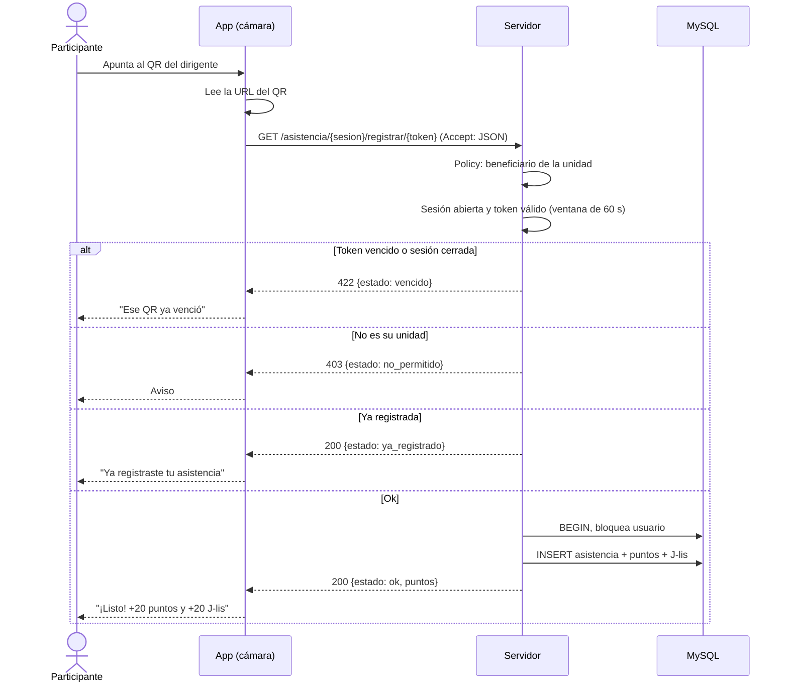

# UC-07 · Escanear asistencia — secuencia

```mermaid
sequenceDiagram
    actor U as Participante
    participant App as App (cámara)
    participant API as Servidor
    participant DB as MySQL

    U->>App: Apunta al QR del dirigente
    App->>App: Lee la URL del QR
    App->>API: GET /asistencia/{sesion}/registrar/{token} (Accept: JSON)
    API->>API: Policy: beneficiario de la unidad
    API->>API: Sesión abierta y token válido (ventana de 60 s)
    alt Token vencido o sesión cerrada
        API-->>App: 422 {estado: vencido}
        App-->>U: "Ese QR ya venció"
    else No es su unidad
        API-->>App: 403 {estado: no_permitido}
        App-->>U: Aviso
    else Ya registrada
        API-->>App: 200 {estado: ya_registrado}
        App-->>U: "Ya registraste tu asistencia"
    else Ok
        API->>DB: BEGIN, bloquea usuario
        API->>DB: INSERT asistencia + puntos + J-lis
        API-->>App: 200 {estado: ok, puntos}
        App-->>U: "¡Listo! +20 puntos y +20 J-lis"
    end
```
