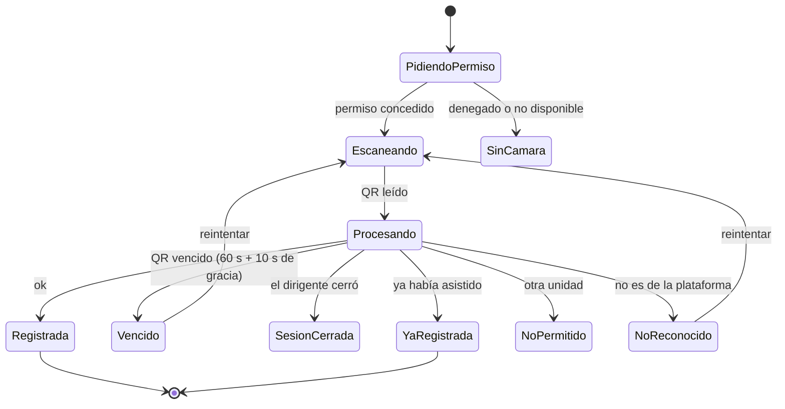

# UC-07 · Escanear asistencia — estados

```mermaid
stateDiagram-v2
    [*] --> PidiendoPermiso
    PidiendoPermiso --> Escaneando: permiso concedido
    PidiendoPermiso --> SinCamara: denegado o no disponible
    Escaneando --> Procesando: QR leído
    Procesando --> Registrada: ok
    Procesando --> Vencido: QR vencido (60 s + 10 s de gracia)
    Procesando --> SesionCerrada: el dirigente cerró
    Procesando --> YaRegistrada: ya había asistido
    Procesando --> NoPermitido: otra unidad
    Procesando --> NoReconocido: no es de la plataforma
    Vencido --> Escaneando: reintentar
    NoReconocido --> Escaneando: reintentar
    Registrada --> [*]
    YaRegistrada --> [*]
```
