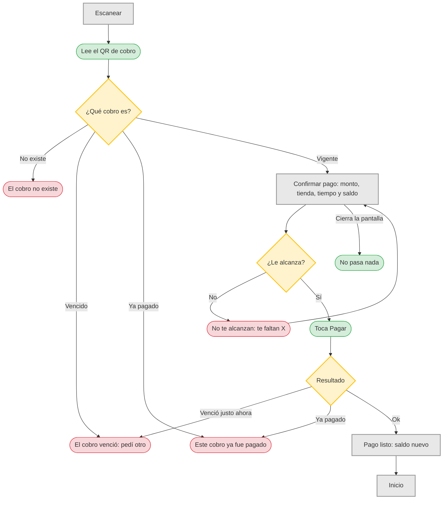

# UC-08 · Pagar en la tienda — flujo

```mermaid
graph TD
    Escanear["Escanear"] --> Lee(["Lee el QR de cobro"])
    Lee --> Cobro{"¿Qué cobro es?"}
    Cobro -->|"No existe"| NoEx(["El cobro no existe"])
    Cobro -->|"Vencido"| Venc(["El cobro venció: pedí otro"])
    Cobro -->|"Ya pagado"| YaP(["Este cobro ya fue pagado"])
    Cobro -->|"Vigente"| Conf["Confirmar pago: monto, tienda, tiempo y saldo"]
    Conf --> Alcanza{"¿Le alcanza?"}
    Alcanza -->|"No"| Falta(["No te alcanzan: te faltan X"])
    Falta --> Conf
    Alcanza -->|"Sí"| Paga(["Toca Pagar"])
    Conf -->|"Cierra la pantalla"| Fin(["No pasa nada"])
    Paga --> Res{"Resultado"}
    Res -->|"Venció justo ahora"| Venc
    Res -->|"Ya pagado"| YaP
    Res -->|"Ok"| Ok["Pago listo: saldo nuevo"]
    Ok --> Inicio["Inicio"]

    class Escanear,Conf,Ok,Inicio screen
    class Cobro,Alcanza,Res decision
    class Lee,Paga,Fin action
    class NoEx,Venc,YaP,Falta error

    classDef screen fill:#e8e8e8,stroke:#999,stroke-width:2px
    classDef decision fill:#fff3cd,stroke:#ffc107,stroke-width:2px
    classDef action fill:#d4edda,stroke:#28a745,stroke-width:1px
    classDef error fill:#f8d7da,stroke:#dc3545,stroke-width:1px
```
