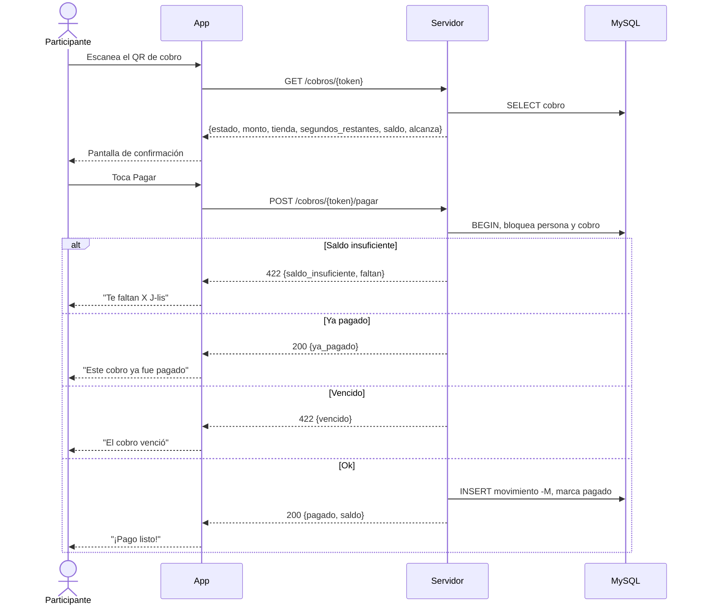

# UC-08 · Pagar en la tienda — secuencia

```mermaid
sequenceDiagram
    actor U as Participante
    participant App as App
    participant API as Servidor
    participant DB as MySQL

    U->>App: Escanea el QR de cobro
    App->>API: GET /cobros/{token}
    API->>DB: SELECT cobro
    API-->>App: {estado, monto, tienda, segundos_restantes, saldo, alcanza}
    App-->>U: Pantalla de confirmación
    U->>App: Toca Pagar
    App->>API: POST /cobros/{token}/pagar
    API->>DB: BEGIN, bloquea persona y cobro
    alt Saldo insuficiente
        API-->>App: 422 {saldo_insuficiente, faltan}
        App-->>U: "Te faltan X J-lis"
    else Ya pagado
        API-->>App: 200 {ya_pagado}
        App-->>U: "Este cobro ya fue pagado"
    else Vencido
        API-->>App: 422 {vencido}
        App-->>U: "El cobro venció"
    else Ok
        API->>DB: INSERT movimiento -M, marca pagado
        API-->>App: 200 {pagado, saldo}
        App-->>U: "¡Pago listo!"
    end
```
