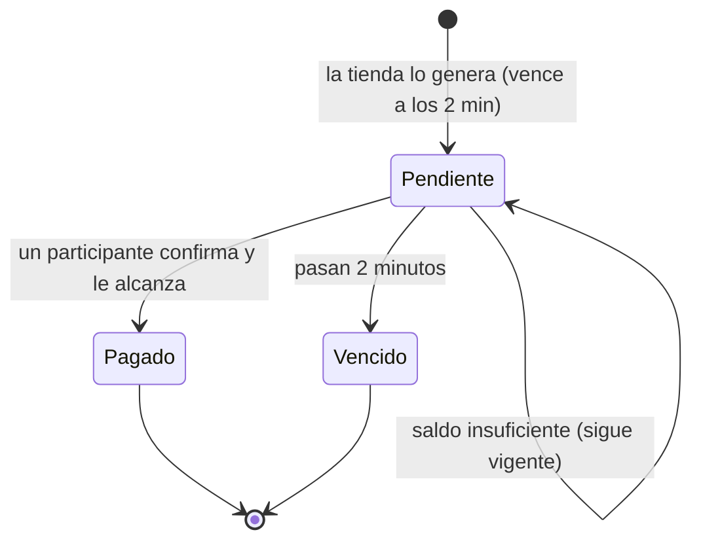

# UC-08 · Pagar en la tienda — estados del cobro

```mermaid
stateDiagram-v2
    [*] --> Pendiente: la tienda lo genera (vence a los 2 min)
    Pendiente --> Pagado: un participante confirma y le alcanza
    Pendiente --> Vencido: pasan 2 minutos
    Pendiente --> Pendiente: saldo insuficiente (sigue vigente)
    Pagado --> [*]
    Vencido --> [*]
```
