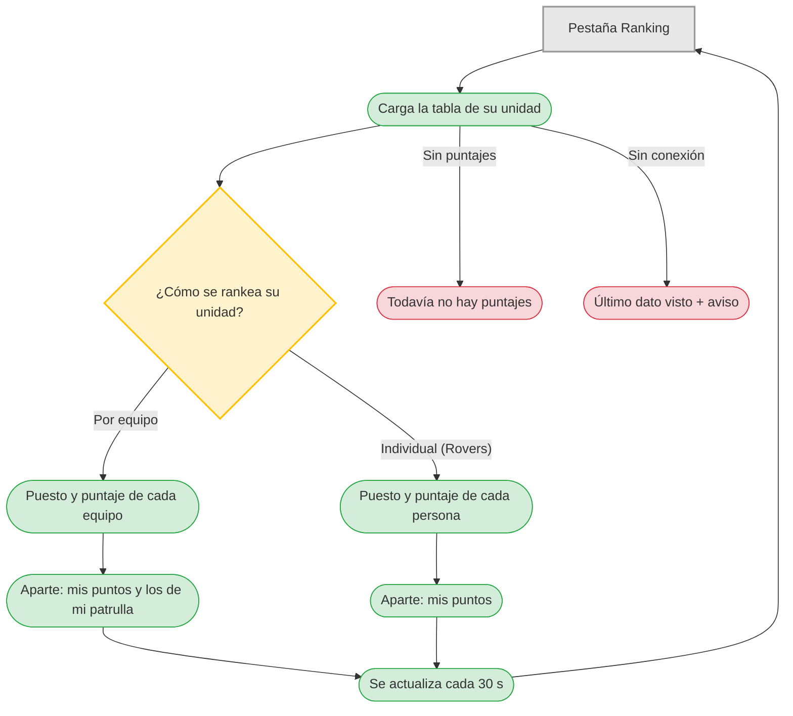

# UC-09 · Ranking — flujo

```mermaid
graph TD
    Tab["Pestaña Ranking"] --> Carga(["Carga la tabla de su unidad"])
    Carga --> Modo{"¿Cómo se rankea su unidad?"}
    Modo -->|"Por equipo"| Equipos(["Puesto y puntaje de cada equipo"])
    Modo -->|"Individual (Rovers)"| Personas(["Puesto y puntaje de cada persona"])
    Equipos --> Propios(["Aparte: mis puntos y los de mi patrulla"])
    Personas --> Propios2(["Aparte: mis puntos"])
    Propios --> Poll(["Se actualiza cada 30 s"])
    Propios2 --> Poll
    Poll --> Tab
    Carga -->|"Sin puntajes"| Vacio(["Todavía no hay puntajes"])
    Carga -->|"Sin conexión"| Viejo(["Último dato visto + aviso"])

    class Tab screen
    class Modo decision
    class Carga,Equipos,Personas,Propios,Propios2,Poll action
    class Vacio,Viejo error

    classDef screen fill:#e8e8e8,stroke:#999,stroke-width:2px
    classDef decision fill:#fff3cd,stroke:#ffc107,stroke-width:2px
    classDef action fill:#d4edda,stroke:#28a745,stroke-width:1px
    classDef error fill:#f8d7da,stroke:#dc3545,stroke-width:1px
```
