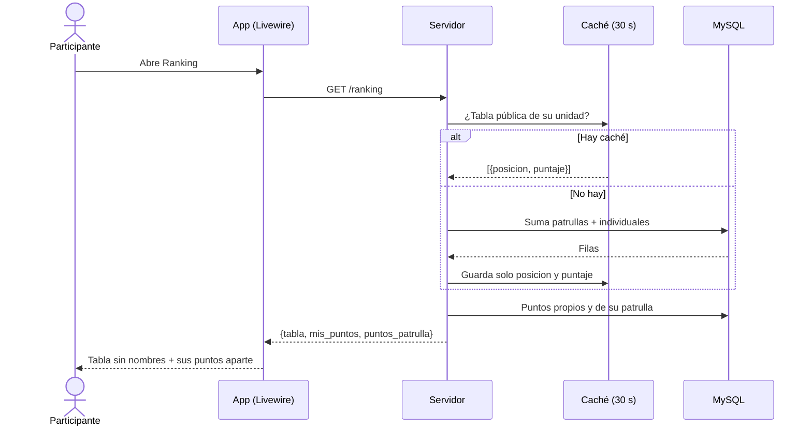

# UC-09 · Ranking — secuencia

```mermaid
sequenceDiagram
    actor U as Participante
    participant App as App (Livewire)
    participant API as Servidor
    participant Cache as Caché (30 s)
    participant DB as MySQL

    U->>App: Abre Ranking
    App->>API: GET /ranking
    API->>Cache: ¿Tabla pública de su unidad?
    alt Hay caché
        Cache-->>API: [{posicion, puntaje}]
    else No hay
        API->>DB: Suma patrullas + individuales
        DB-->>API: Filas
        API->>Cache: Guarda solo posicion y puntaje
    end
    API->>DB: Puntos propios y de su patrulla
    API-->>App: {tabla, mis_puntos, puntos_patrulla}
    App-->>U: Tabla sin nombres + sus puntos aparte
```
