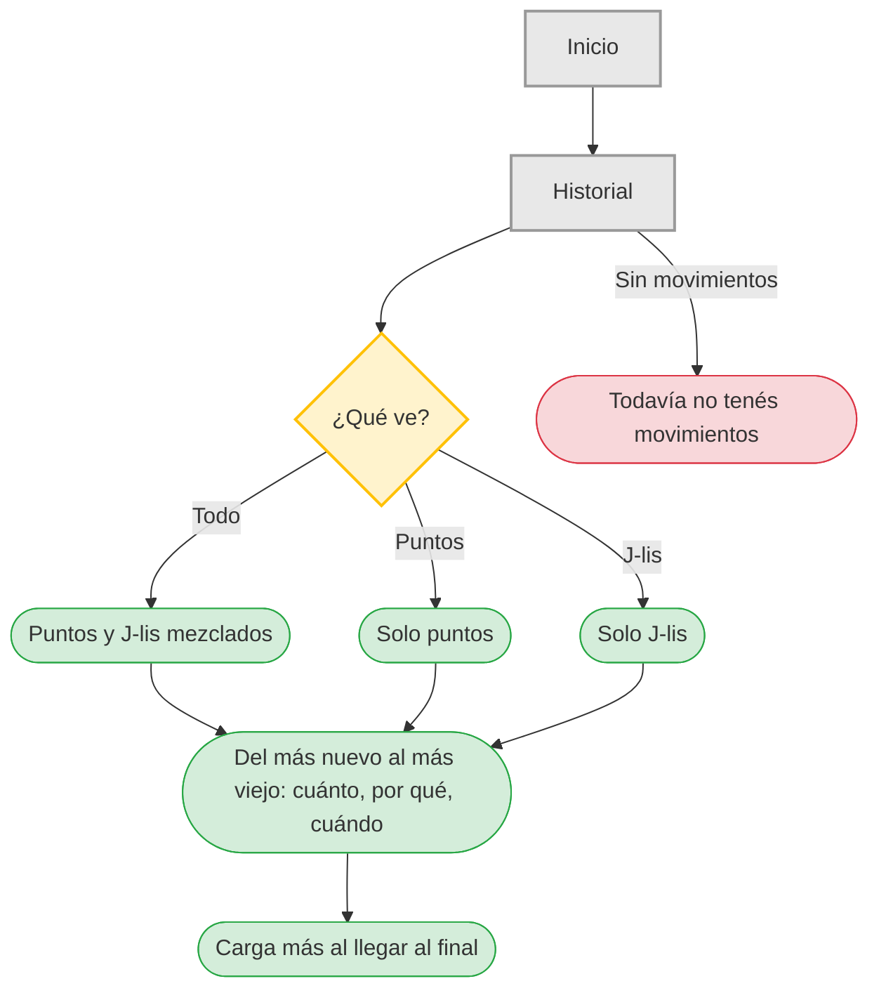

# UC-10 · Historial — flujo

```mermaid
graph TD
    Inicio["Inicio"] --> Hist["Historial"]
    Hist --> Filtro{"¿Qué ve?"}
    Filtro -->|"Todo"| Todo(["Puntos y J-lis mezclados"])
    Filtro -->|"Puntos"| P(["Solo puntos"])
    Filtro -->|"J-lis"| J(["Solo J-lis"])
    Todo --> Lista(["Del más nuevo al más viejo: cuánto, por qué, cuándo"])
    P --> Lista
    J --> Lista
    Lista --> Mas(["Carga más al llegar al final"])
    Hist -->|"Sin movimientos"| Vacio(["Todavía no tenés movimientos"])

    class Inicio,Hist screen
    class Filtro decision
    class Todo,P,J,Lista,Mas action
    class Vacio error

    classDef screen fill:#e8e8e8,stroke:#999,stroke-width:2px
    classDef decision fill:#fff3cd,stroke:#ffc107,stroke-width:2px
    classDef action fill:#d4edda,stroke:#28a745,stroke-width:1px
    classDef error fill:#f8d7da,stroke:#dc3545,stroke-width:1px
```
