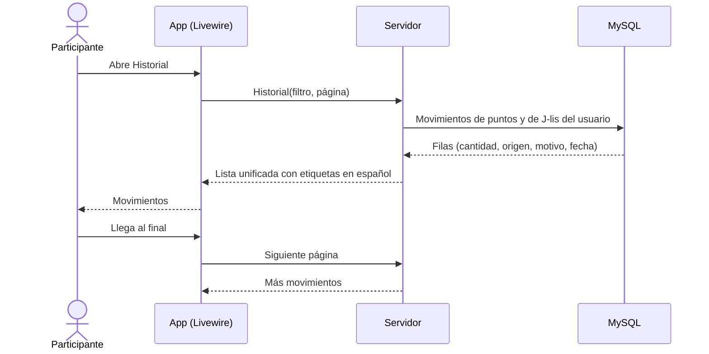

# UC-10 · Historial — secuencia

```mermaid
sequenceDiagram
    actor U as Participante
    participant App as App (Livewire)
    participant API as Servidor
    participant DB as MySQL

    U->>App: Abre Historial
    App->>API: Historial(filtro, página)
    API->>DB: Movimientos de puntos y de J-lis del usuario
    DB-->>API: Filas (cantidad, origen, motivo, fecha)
    API-->>App: Lista unificada con etiquetas en español
    App-->>U: Movimientos
    U->>App: Llega al final
    App->>API: Siguiente página
    API-->>App: Más movimientos
```
