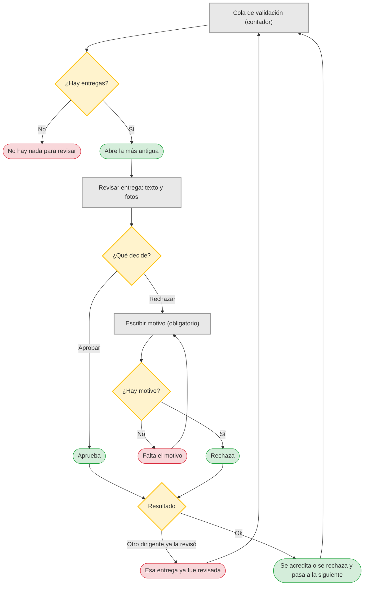

# UC-11 · Cola de validación — flujo

Siempre acotada a la unidad del dirigente.

```mermaid
graph TD
    Cola["Cola de validación (contador)"] --> Hay{"¿Hay entregas?"}
    Hay -->|"No"| Vacia(["No hay nada para revisar"])
    Hay -->|"Sí"| Elige(["Abre la más antigua"])
    Elige --> Revisar["Revisar entrega: texto y fotos"]
    Revisar --> Dec{"¿Qué decide?"}
    Dec -->|"Aprobar"| Aprueba(["Aprueba"])
    Dec -->|"Rechazar"| Motivo["Escribir motivo (obligatorio)"]
    Motivo --> MotivoOk{"¿Hay motivo?"}
    MotivoOk -->|"No"| ErrMot(["Falta el motivo"])
    ErrMot --> Motivo
    MotivoOk -->|"Sí"| Rechaza(["Rechaza"])
    Aprueba --> Res{"Resultado"}
    Rechaza --> Res
    Res -->|"Otro dirigente ya la revisó"| YaRev(["Esa entrega ya fue revisada"])
    Res -->|"Ok"| Sig(["Se acredita o se rechaza y pasa a la siguiente"])
    YaRev --> Cola
    Sig --> Cola

    class Cola,Revisar,Motivo screen
    class Hay,Dec,MotivoOk,Res decision
    class Elige,Aprueba,Rechaza,Sig action
    class Vacia,ErrMot,YaRev error

    classDef screen fill:#e8e8e8,stroke:#999,stroke-width:2px
    classDef decision fill:#fff3cd,stroke:#ffc107,stroke-width:2px
    classDef action fill:#d4edda,stroke:#28a745,stroke-width:1px
    classDef error fill:#f8d7da,stroke:#dc3545,stroke-width:1px
```
