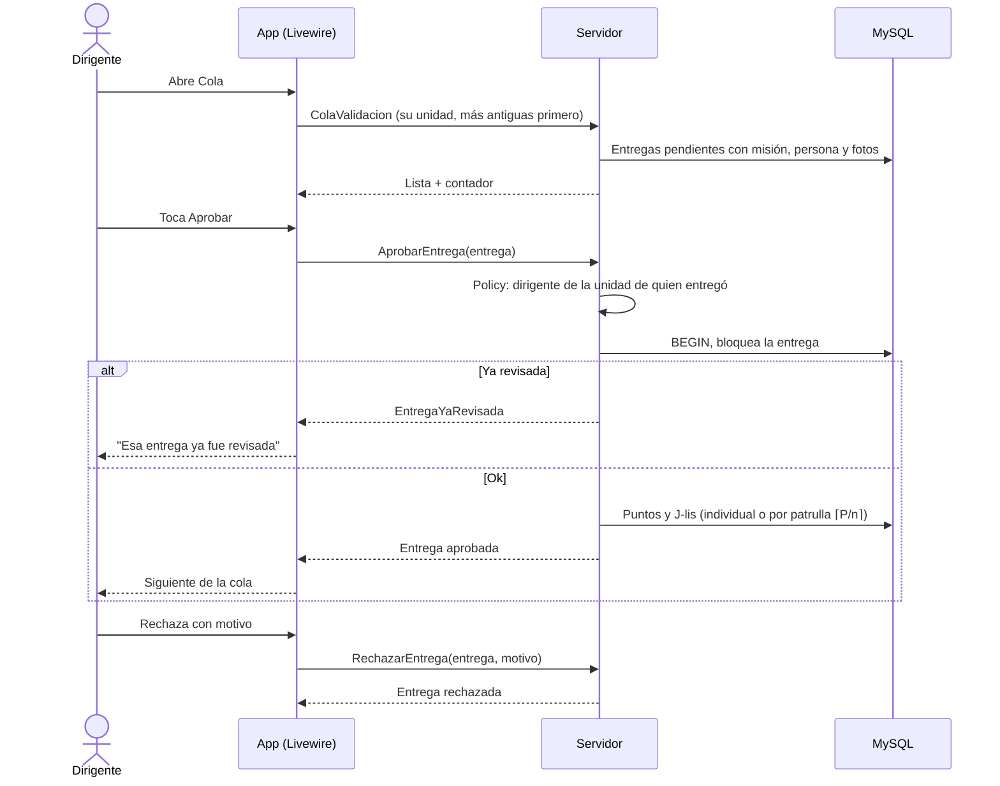

# UC-11 · Cola de validación — secuencia

```mermaid
sequenceDiagram
    actor D as Dirigente
    participant App as App (Livewire)
    participant API as Servidor
    participant DB as MySQL

    D->>App: Abre Cola
    App->>API: ColaValidacion (su unidad, más antiguas primero)
    API->>DB: Entregas pendientes con misión, persona y fotos
    API-->>App: Lista + contador
    D->>App: Toca Aprobar
    App->>API: AprobarEntrega(entrega)
    API->>API: Policy: dirigente de la unidad de quien entregó
    API->>DB: BEGIN, bloquea la entrega
    alt Ya revisada
        API-->>App: EntregaYaRevisada
        App-->>D: "Esa entrega ya fue revisada"
    else Ok
        API->>DB: Puntos y J-lis (individual o por patrulla ⌈P/n⌉)
        API-->>App: Entrega aprobada
        App-->>D: Siguiente de la cola
    end
    D->>App: Rechaza con motivo
    App->>API: RechazarEntrega(entrega, motivo)
    API-->>App: Entrega rechazada
```
