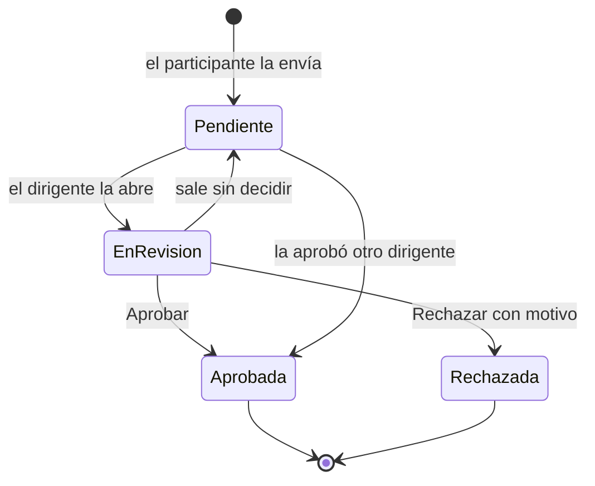

# UC-11 · Cola de validación — estados de una entrega

```mermaid
stateDiagram-v2
    [*] --> Pendiente: el participante la envía
    Pendiente --> EnRevision: el dirigente la abre
    EnRevision --> Aprobada: Aprobar
    EnRevision --> Rechazada: Rechazar con motivo
    EnRevision --> Pendiente: sale sin decidir
    Pendiente --> Aprobada: la aprobó otro dirigente
    Aprobada --> [*]
    Rechazada --> [*]
```
