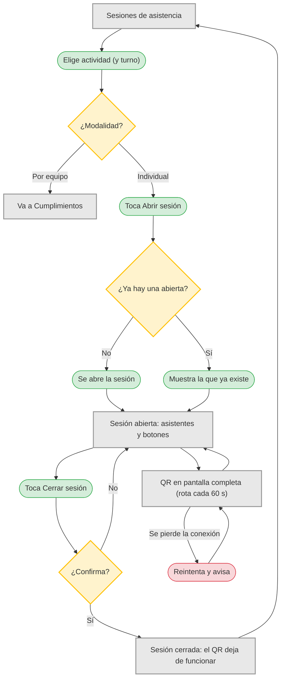

# UC-12 · Sesión de asistencia y QR en pantalla completa — flujo

```mermaid
graph TD
    As["Sesiones de asistencia"] --> Elige(["Elige actividad (y turno)"])
    Elige --> Tipo{"¿Modalidad?"}
    Tipo -->|"Por equipo"| ACumpl["Va a Cumplimientos"]
    Tipo -->|"Individual"| Abrir(["Toca Abrir sesión"])
    Abrir --> Abierta{"¿Ya hay una abierta?"}
    Abierta -->|"Sí"| Muestra(["Muestra la que ya existe"])
    Abierta -->|"No"| Crea(["Se abre la sesión"])
    Crea --> Panel["Sesión abierta: asistentes y botones"]
    Muestra --> Panel
    Panel --> QR["QR en pantalla completa (rota cada 60 s)"]
    QR --> Panel
    Panel --> Cerrar(["Toca Cerrar sesión"])
    Cerrar --> Conf{"¿Confirma?"}
    Conf -->|"No"| Panel
    Conf -->|"Sí"| Cerrada["Sesión cerrada: el QR deja de funcionar"]
    Cerrada --> As
    QR -->|"Se pierde la conexión"| Reint(["Reintenta y avisa"])
    Reint --> QR

    class As,Panel,QR,Cerrada,ACumpl screen
    class Tipo,Abierta,Conf decision
    class Elige,Abrir,Crea,Muestra,Cerrar action
    class Reint error

    classDef screen fill:#e8e8e8,stroke:#999,stroke-width:2px
    classDef decision fill:#fff3cd,stroke:#ffc107,stroke-width:2px
    classDef action fill:#d4edda,stroke:#28a745,stroke-width:1px
    classDef error fill:#f8d7da,stroke:#dc3545,stroke-width:1px
```
