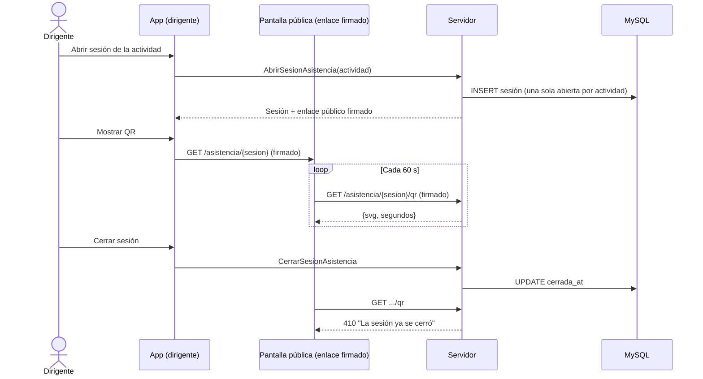

# UC-12 · Sesión de asistencia — secuencia

```mermaid
sequenceDiagram
    actor D as Dirigente
    participant App as App (dirigente)
    participant Pub as Pantalla pública (enlace firmado)
    participant API as Servidor
    participant DB as MySQL

    D->>App: Abrir sesión de la actividad
    App->>API: AbrirSesionAsistencia(actividad)
    API->>DB: INSERT sesión (una sola abierta por actividad)
    API-->>App: Sesión + enlace público firmado
    D->>App: Mostrar QR
    App->>Pub: GET /asistencia/{sesion} (firmado)
    loop Cada 60 s
        Pub->>API: GET /asistencia/{sesion}/qr (firmado)
        API-->>Pub: {svg, segundos}
    end
    D->>App: Cerrar sesión
    App->>API: CerrarSesionAsistencia
    API->>DB: UPDATE cerrada_at
    Pub->>API: GET .../qr
    API-->>Pub: 410 "La sesión ya se cerró"
```
