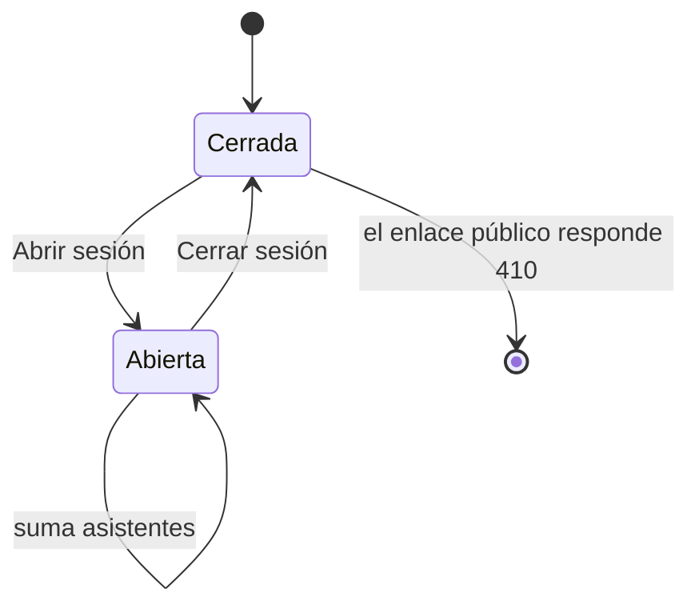

# UC-12 · Sesión de asistencia — estados de la sesión

```mermaid
stateDiagram-v2
    [*] --> Cerrada
    Cerrada --> Abierta: Abrir sesión
    Abierta --> Abierta: el QR rota cada 60 s
    Abierta --> Abierta: suma asistentes
    Abierta --> Cerrada: Cerrar sesión
    Cerrada --> [*]: el enlace público responde 410
```
