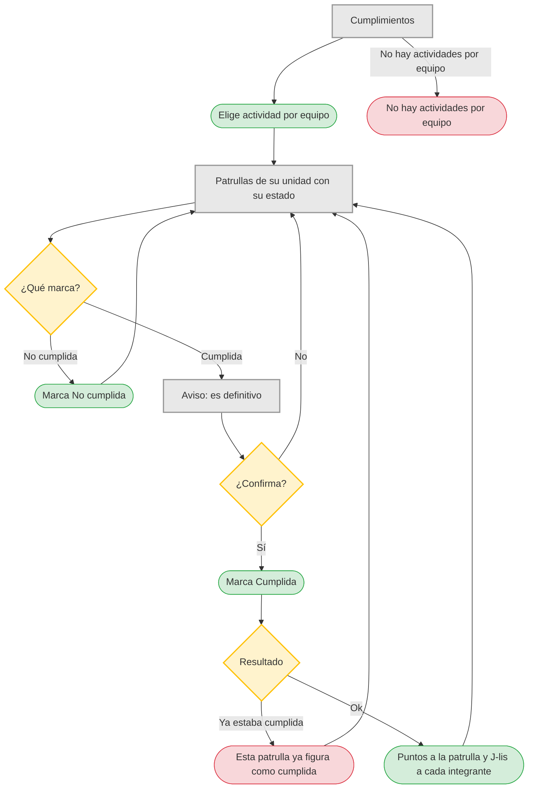

# UC-13 · Marcar patrullas como cumplidas — flujo

```mermaid
graph TD
    Cum["Cumplimientos"] --> Elige(["Elige actividad por equipo"])
    Elige --> Lista["Patrullas de su unidad con su estado"]
    Lista --> Acc{"¿Qué marca?"}
    Acc -->|"No cumplida"| NoC(["Marca No cumplida"])
    Acc -->|"Cumplida"| Aviso["Aviso: es definitivo"]
    Aviso --> Conf{"¿Confirma?"}
    Conf -->|"No"| Lista
    Conf -->|"Sí"| Cumple(["Marca Cumplida"])
    Cumple --> Res{"Resultado"}
    Res -->|"Ya estaba cumplida"| Ya(["Esta patrulla ya figura como cumplida"])
    Res -->|"Ok"| Acred(["Puntos a la patrulla y J-lis a cada integrante"])
    NoC --> Lista
    Acred --> Lista
    Ya --> Lista
    Cum -->|"No hay actividades por equipo"| Vacio(["No hay actividades por equipo"])

    class Cum,Lista,Aviso screen
    class Acc,Conf,Res decision
    class Elige,NoC,Cumple,Acred action
    class Ya,Vacio error

    classDef screen fill:#e8e8e8,stroke:#999,stroke-width:2px
    classDef decision fill:#fff3cd,stroke:#ffc107,stroke-width:2px
    classDef action fill:#d4edda,stroke:#28a745,stroke-width:1px
    classDef error fill:#f8d7da,stroke:#dc3545,stroke-width:1px
```
