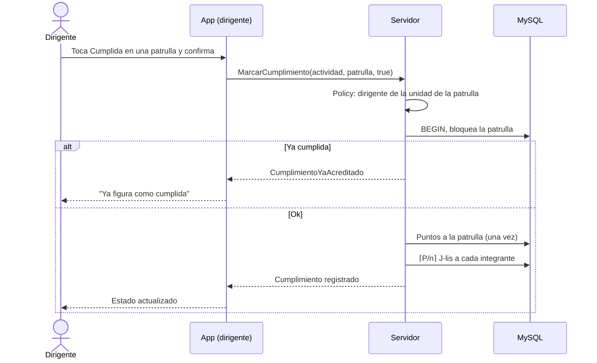

# UC-13 · Marcar cumplidas — secuencia

```mermaid
sequenceDiagram
    actor D as Dirigente
    participant App as App (dirigente)
    participant API as Servidor
    participant DB as MySQL

    D->>App: Toca Cumplida en una patrulla y confirma
    App->>API: MarcarCumplimiento(actividad, patrulla, true)
    API->>API: Policy: dirigente de la unidad de la patrulla
    API->>DB: BEGIN, bloquea la patrulla
    alt Ya cumplida
        API-->>App: CumplimientoYaAcreditado
        App-->>D: "Ya figura como cumplida"
    else Ok
        API->>DB: Puntos a la patrulla (una vez)
        API->>DB: ⌈P/n⌉ J-lis a cada integrante
        API-->>App: Cumplimiento registrado
        App-->>D: Estado actualizado
    end
```
