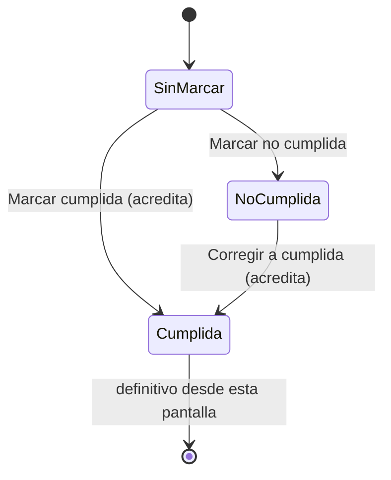

# UC-13 · Cumplimiento de una patrulla — estados

```mermaid
stateDiagram-v2
    [*] --> SinMarcar
    SinMarcar --> NoCumplida: Marcar no cumplida
    SinMarcar --> Cumplida: Marcar cumplida (acredita)
    NoCumplida --> Cumplida: Corregir a cumplida (acredita)
    Cumplida --> [*]: definitivo desde esta pantalla
```
