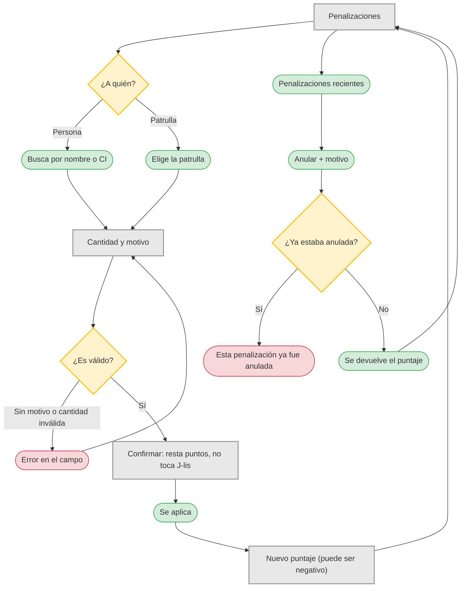

# UC-14 · Penalizaciones — flujo

```mermaid
graph TD
    Pen["Penalizaciones"] --> Que{"¿A quién?"}
    Que -->|"Persona"| BuscaP(["Busca por nombre o CI"])
    Que -->|"Patrulla"| EligeP(["Elige la patrulla"])
    BuscaP --> Form["Cantidad y motivo"]
    EligeP --> Form
    Form --> Val{"¿Es válido?"}
    Val -->|"Sin motivo o cantidad inválida"| Err(["Error en el campo"])
    Err --> Form
    Val -->|"Sí"| Conf["Confirmar: resta puntos, no toca J-lis"]
    Conf --> Aplica(["Se aplica"])
    Aplica --> Nuevo["Nuevo puntaje (puede ser negativo)"]
    Nuevo --> Pen
    Pen --> Recientes(["Penalizaciones recientes"])
    Recientes --> Anular(["Anular + motivo"])
    Anular --> Res{"¿Ya estaba anulada?"}
    Res -->|"Sí"| Ya(["Esta penalización ya fue anulada"])
    Res -->|"No"| Devuelve(["Se devuelve el puntaje"])
    Devuelve --> Pen

    class Pen,Form,Conf,Nuevo screen
    class Que,Val,Res decision
    class BuscaP,EligeP,Aplica,Anular,Devuelve,Recientes action
    class Err,Ya error

    classDef screen fill:#e8e8e8,stroke:#999,stroke-width:2px
    classDef decision fill:#fff3cd,stroke:#ffc107,stroke-width:2px
    classDef action fill:#d4edda,stroke:#28a745,stroke-width:1px
    classDef error fill:#f8d7da,stroke:#dc3545,stroke-width:1px
```
