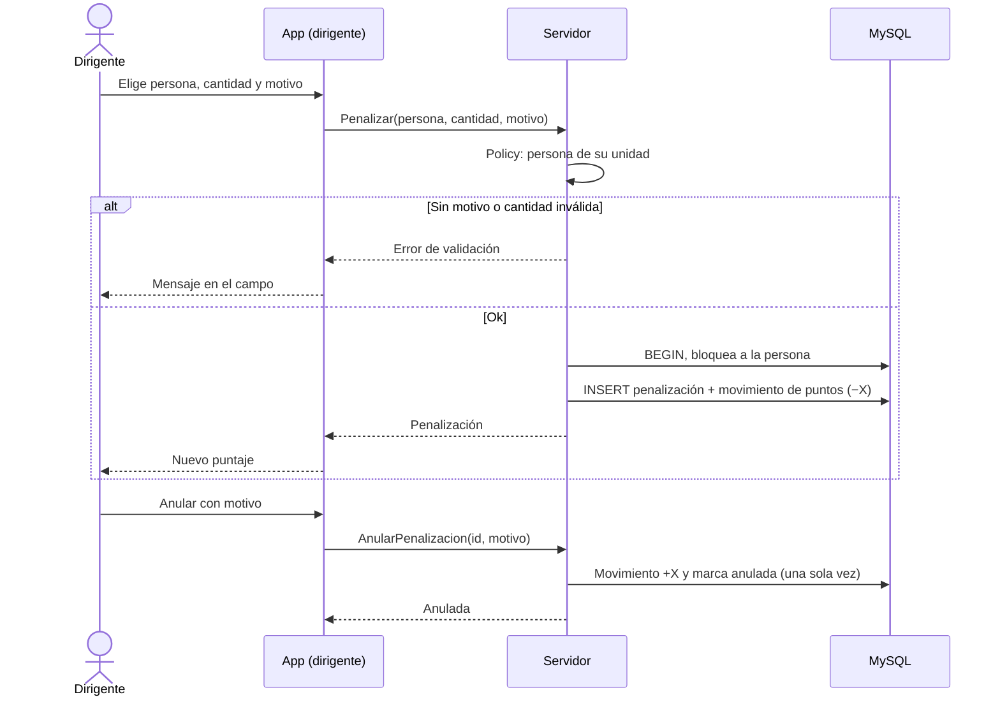

# UC-14 · Penalizaciones — secuencia

```mermaid
sequenceDiagram
    actor D as Dirigente
    participant App as App (dirigente)
    participant API as Servidor
    participant DB as MySQL

    D->>App: Elige persona, cantidad y motivo
    App->>API: Penalizar(persona, cantidad, motivo)
    API->>API: Policy: persona de su unidad
    alt Sin motivo o cantidad inválida
        API-->>App: Error de validación
        App-->>D: Mensaje en el campo
    else Ok
        API->>DB: BEGIN, bloquea a la persona
        API->>DB: INSERT penalización + movimiento de puntos (−X)
        API-->>App: Penalización
        App-->>D: Nuevo puntaje
    end
    D->>App: Anular con motivo
    App->>API: AnularPenalizacion(id, motivo)
    API->>DB: Movimiento +X y marca anulada (una sola vez)
    API-->>App: Anulada
```
