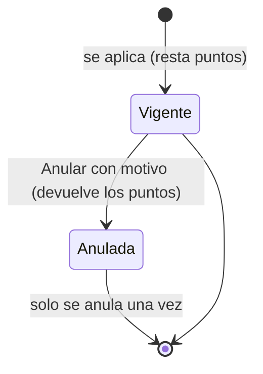

# UC-14 · Penalización — estados

```mermaid
stateDiagram-v2
    [*] --> Vigente: se aplica (resta puntos)
    Vigente --> Anulada: Anular con motivo (devuelve los puntos)
    Anulada --> [*]: solo se anula una vez
    Vigente --> [*]
```
