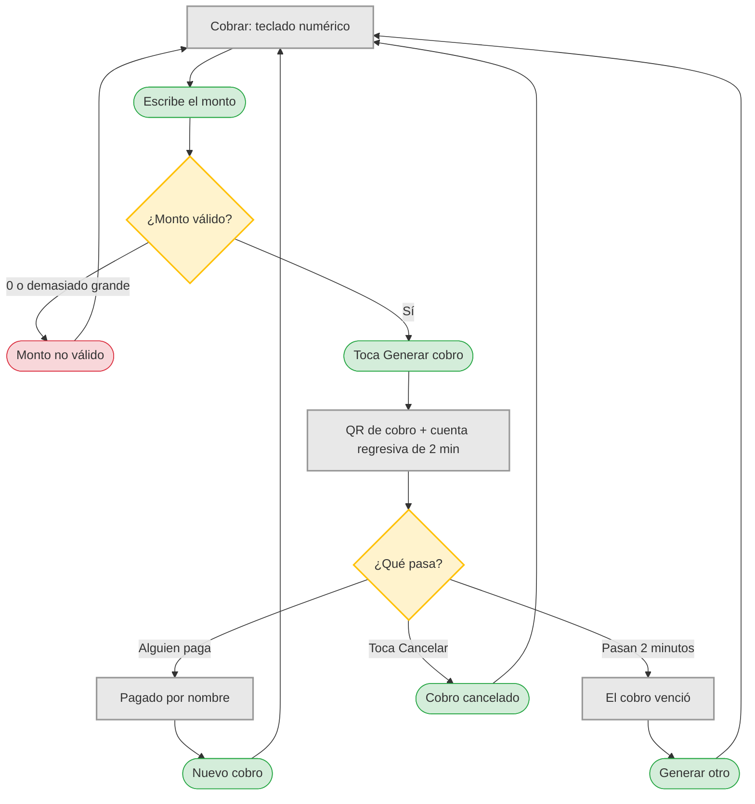

# UC-15 · Cobrar — flujo

```mermaid
graph TD
    Cobrar["Cobrar: teclado numérico"] --> Monto(["Escribe el monto"])
    Monto --> Val{"¿Monto válido?"}
    Val -->|"0 o demasiado grande"| Err(["Monto no válido"])
    Err --> Cobrar
    Val -->|"Sí"| Gen(["Toca Generar cobro"])
    Gen --> QR["QR de cobro + cuenta regresiva de 2 min"]
    QR --> Estado{"¿Qué pasa?"}
    Estado -->|"Alguien paga"| Pagado["Pagado por nombre"]
    Estado -->|"Pasan 2 minutos"| Venc["El cobro venció"]
    Estado -->|"Toca Cancelar"| Cancel(["Cobro cancelado"])
    Pagado --> Nuevo(["Nuevo cobro"])
    Venc --> Otro(["Generar otro"])
    Cancel --> Cobrar
    Nuevo --> Cobrar
    Otro --> Cobrar

    class Cobrar,QR,Pagado,Venc screen
    class Val,Estado decision
    class Monto,Gen,Nuevo,Otro,Cancel action
    class Err error

    classDef screen fill:#e8e8e8,stroke:#999,stroke-width:2px
    classDef decision fill:#fff3cd,stroke:#ffc107,stroke-width:2px
    classDef action fill:#d4edda,stroke:#28a745,stroke-width:1px
    classDef error fill:#f8d7da,stroke:#dc3545,stroke-width:1px
```
