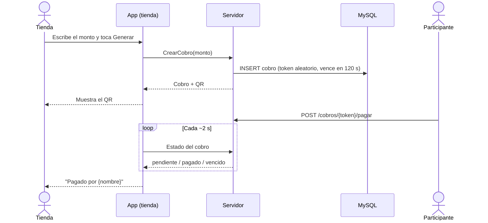

# UC-15 · Cobrar — secuencia

```mermaid
sequenceDiagram
    actor T as Tienda
    participant App as App (tienda)
    participant API as Servidor
    participant DB as MySQL
    actor P as Participante

    T->>App: Escribe el monto y toca Generar
    App->>API: CrearCobro(monto)
    API->>DB: INSERT cobro (token aleatorio, vence en 120 s)
    API-->>App: Cobro + QR
    App-->>T: Muestra el QR
    P->>API: POST /cobros/{token}/pagar
    loop Cada ~2 s
        App->>API: Estado del cobro
        API-->>App: pendiente / pagado / vencido
    end
    App-->>T: "Pagado por {nombre}"
```
