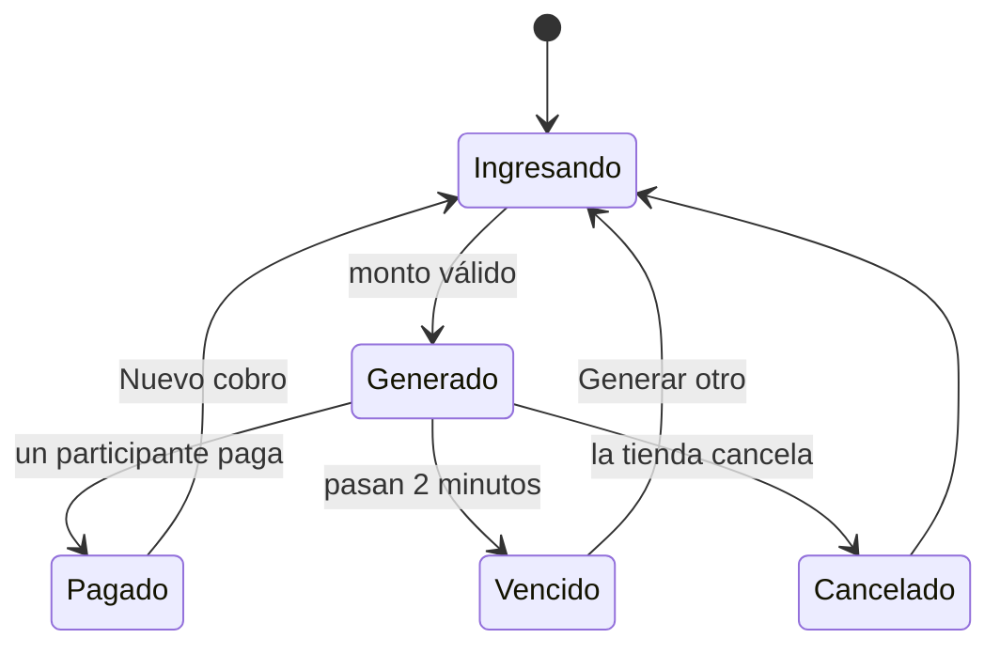

# UC-15 · Cobrar — estados

```mermaid
stateDiagram-v2
    [*] --> Ingresando
    Ingresando --> Generado: monto válido
    Generado --> Pagado: un participante paga
    Generado --> Vencido: pasan 2 minutos
    Generado --> Cancelado: la tienda cancela
    Pagado --> Ingresando: Nuevo cobro
    Vencido --> Ingresando: Generar otro
    Cancelado --> Ingresando
```
