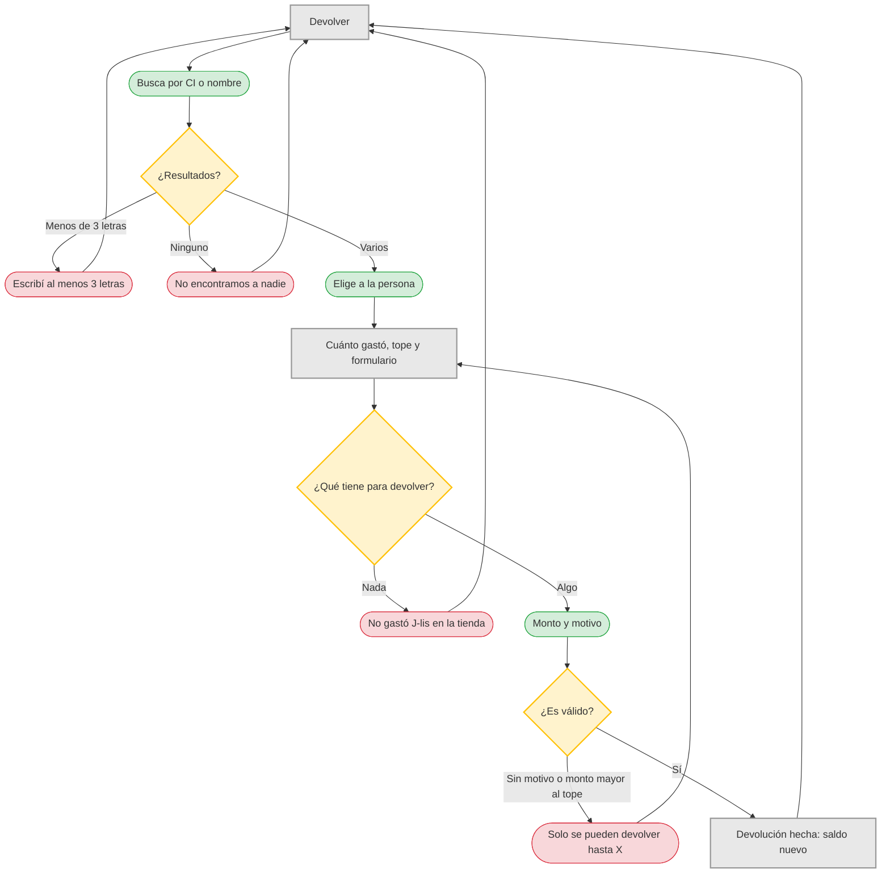

# UC-16 · Devolver — flujo

```mermaid
graph TD
    Dev["Devolver"] --> Busca(["Busca por CI o nombre"])
    Busca --> Res{"¿Resultados?"}
    Res -->|"Menos de 3 letras"| Mas(["Escribí al menos 3 letras"])
    Res -->|"Ninguno"| Nada(["No encontramos a nadie"])
    Res -->|"Varios"| Elige(["Elige a la persona"])
    Mas --> Dev
    Nada --> Dev
    Elige --> Form["Cuánto gastó, tope y formulario"]
    Form --> Tope{"¿Qué tiene para devolver?"}
    Tope -->|"Nada"| NoGasto(["No gastó J-lis en la tienda"])
    Tope -->|"Algo"| Llena(["Monto y motivo"])
    Llena --> Val{"¿Es válido?"}
    Val -->|"Sin motivo o monto mayor al tope"| Err(["Solo se pueden devolver hasta X"])
    Err --> Form
    Val -->|"Sí"| Ok["Devolución hecha: saldo nuevo"]
    Ok --> Dev
    NoGasto --> Dev

    class Dev,Form,Ok screen
    class Res,Tope,Val decision
    class Busca,Elige,Llena action
    class Mas,Nada,NoGasto,Err error

    classDef screen fill:#e8e8e8,stroke:#999,stroke-width:2px
    classDef decision fill:#fff3cd,stroke:#ffc107,stroke-width:2px
    classDef action fill:#d4edda,stroke:#28a745,stroke-width:1px
    classDef error fill:#f8d7da,stroke:#dc3545,stroke-width:1px
```
