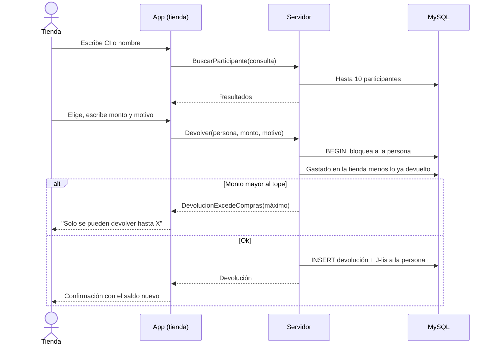

# UC-16 · Devolver — secuencia

```mermaid
sequenceDiagram
    actor T as Tienda
    participant App as App (tienda)
    participant API as Servidor
    participant DB as MySQL

    T->>App: Escribe CI o nombre
    App->>API: BuscarParticipante(consulta)
    API->>DB: Hasta 10 participantes
    API-->>App: Resultados
    T->>App: Elige, escribe monto y motivo
    App->>API: Devolver(persona, monto, motivo)
    API->>DB: BEGIN, bloquea a la persona
    API->>DB: Gastado en la tienda menos lo ya devuelto
    alt Monto mayor al tope
        API-->>App: DevolucionExcedeCompras(máximo)
        App-->>T: "Solo se pueden devolver hasta X"
    else Ok
        API->>DB: INSERT devolución + J-lis a la persona
        API-->>App: Devolución
        App-->>T: Confirmación con el saldo nuevo
    end
```
