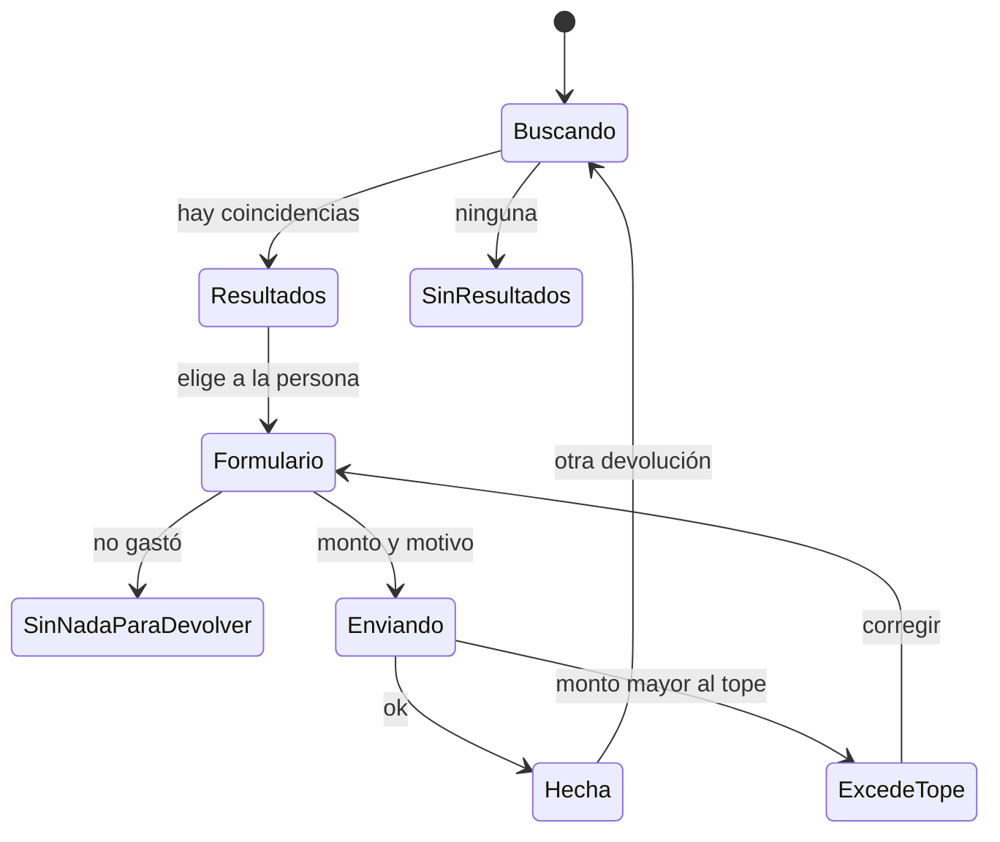

# UC-16 · Devolver — estados

```mermaid
stateDiagram-v2
    [*] --> Buscando
    Buscando --> Resultados: hay coincidencias
    Buscando --> SinResultados: ninguna
    Resultados --> Formulario: elige a la persona
    Formulario --> SinNadaParaDevolver: no gastó
    Formulario --> Enviando: monto y motivo
    Enviando --> Hecha: ok
    Enviando --> ExcedeTope: monto mayor al tope
    ExcedeTope --> Formulario: corregir
    Hecha --> Buscando: otra devolución
```
