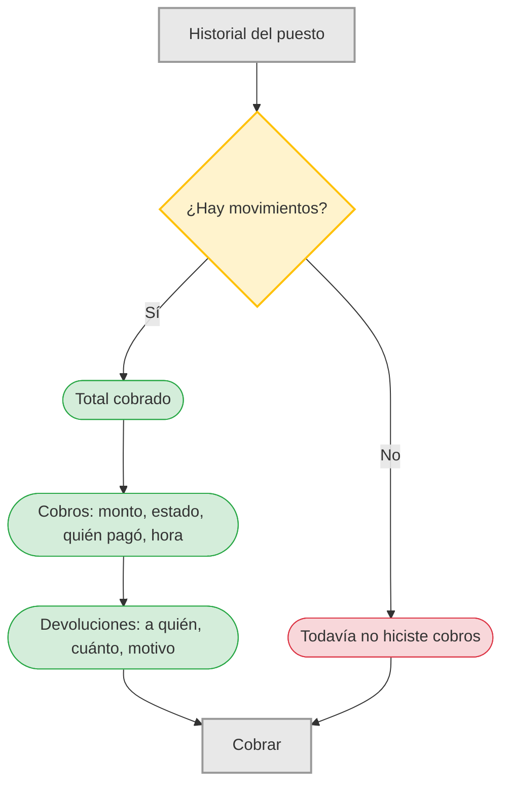

# UC-16b · Historial del puesto — flujo

```mermaid
graph TD
    Hist["Historial del puesto"] --> Carga{"¿Hay movimientos?"}
    Carga -->|"No"| Vacio(["Todavía no hiciste cobros"])
    Carga -->|"Sí"| Tot(["Total cobrado"])
    Tot --> Lista(["Cobros: monto, estado, quién pagó, hora"])
    Lista --> Dev(["Devoluciones: a quién, cuánto, motivo"])
    Dev --> Cobrar["Cobrar"]
    Vacio --> Cobrar

    class Hist,Cobrar screen
    class Carga decision
    class Tot,Lista,Dev action
    class Vacio error

    classDef screen fill:#e8e8e8,stroke:#999,stroke-width:2px
    classDef decision fill:#fff3cd,stroke:#ffc107,stroke-width:2px
    classDef action fill:#d4edda,stroke:#28a745,stroke-width:1px
    classDef error fill:#f8d7da,stroke:#dc3545,stroke-width:1px
```
