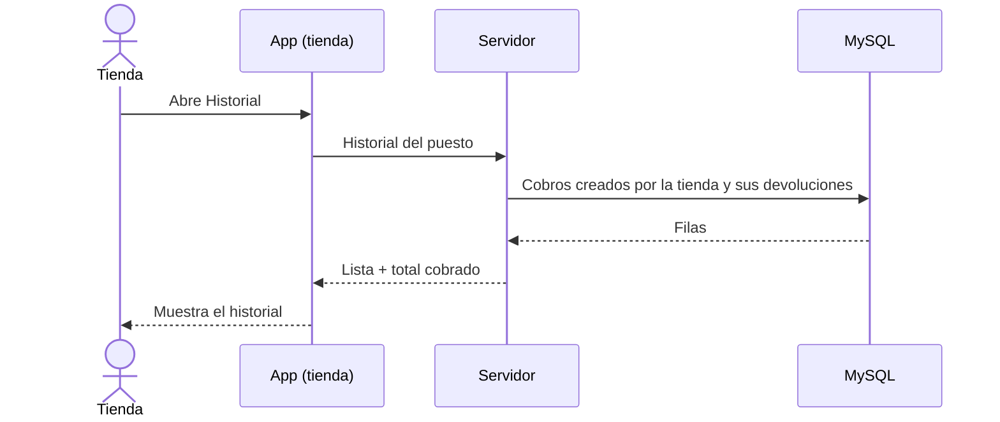

# UC-16b · Historial del puesto — secuencia

```mermaid
sequenceDiagram
    actor T as Tienda
    participant App as App (tienda)
    participant API as Servidor
    participant DB as MySQL

    T->>App: Abre Historial
    App->>API: Historial del puesto
    API->>DB: Cobros creados por la tienda y sus devoluciones
    DB-->>API: Filas
    API-->>App: Lista + total cobrado
    App-->>T: Muestra el historial
```
