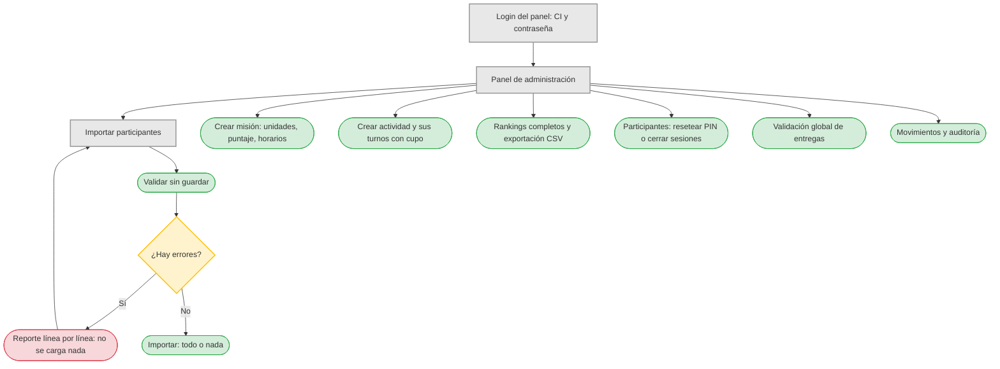

# UC-17 · Flujos del administrador (panel Filament)

Ya construido. Solo documentación: no lleva estados, secuencia ni wireframes.

```mermaid
graph TD
    Login["Login del panel: CI y contraseña"] --> Panel["Panel de administración"]
    Panel --> Imp["Importar participantes"]
    Imp --> Val(["Validar sin guardar"])
    Val --> Errs{"¿Hay errores?"}
    Errs -->|"Sí"| Rep(["Reporte línea por línea: no se carga nada"])
    Rep --> Imp
    Errs -->|"No"| Carga(["Importar: todo o nada"])
    Panel --> Mis(["Crear misión: unidades, puntaje, horarios"])
    Panel --> Act(["Crear actividad y sus turnos con cupo"])
    Panel --> Rank(["Rankings completos y exportación CSV"])
    Panel --> Reset(["Participantes: resetear PIN o cerrar sesiones"])
    Panel --> Val2(["Validación global de entregas"])
    Panel --> Reg(["Movimientos y auditoría"])

    class Login,Panel,Imp screen
    class Errs decision
    class Val,Carga,Mis,Act,Rank,Reset,Val2,Reg action
    class Rep error

    classDef screen fill:#e8e8e8,stroke:#999,stroke-width:2px
    classDef decision fill:#fff3cd,stroke:#ffc107,stroke-width:2px
    classDef action fill:#d4edda,stroke:#28a745,stroke-width:1px
    classDef error fill:#f8d7da,stroke:#dc3545,stroke-width:1px
```
